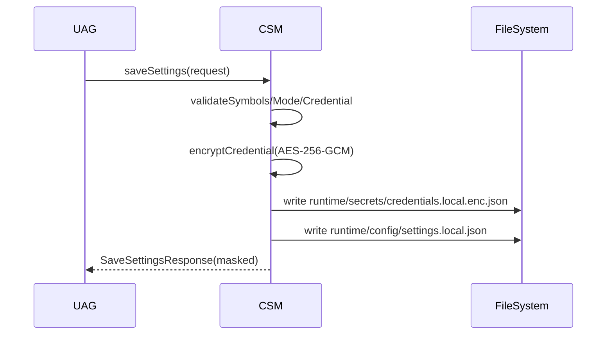
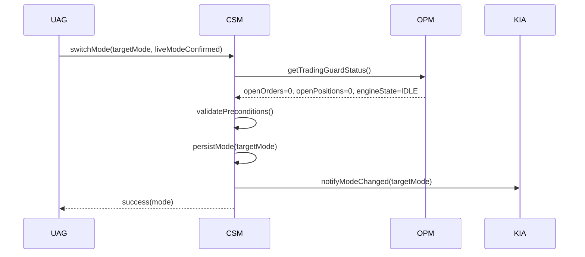

# LLD-CSM v0.1.0

- 문서명: CSM 모듈 저수준 설계서 (LLD)
- 버전: v0.1.0
- 작성일: 2026-02-17
- 기반 문서:
  - `docs/hld/HLD-v0.1.0.md` (특히 4.5, 7, 8)
  - `docs/srs/SRS-v0.1.0.md`
- 모듈: `CSM` (Configuration & Secret Manager)

## 1. 모듈 범위와 책임

`CSM`은 감시 종목/모드/자격정보의 단일 진실 소스(Single Source of Truth)로 동작하며, 저장·조회·검증·보안 처리를 담당한다.

- 감시 종목(1~20), 모드(Mock/Live), 자격정보 저장/조회 (HLD 4.5, SRS FR-001, FR-012, FR-014)
- Git 비추적 경로 기반 로컬 설정/시크릿 저장 (HLD 7, SRS FR-013)
- 민감정보 마스킹/암호화/로그 비노출 정책 적용 (HLD 7.3, SRS NFR-002)
- 재시작 시 설정 복원 가능성 보장 (SRS NFR-003)
- 모드 전환 선행조건 검증 및 안전장치 적용 (HLD 8.2, 8.3)

비범위(Out of Scope):
- 전략 판정, 주문 생성, 체결 처리 로직
- 리포트 계산/집계 로직

## 2. 구성 데이터 모델

## 2.1 ConfigSnapshot (평문 설정)

```json
{
  "version": "v0.1.0",
  "updatedAt": "2026-02-17T08:50:12+09:00",
  "watchSymbols": ["005930", "000660"],
  "mode": "mock",
  "liveModeConfirmed": false,
  "credentialsRef": "cred-20260217-01"
}
```

필드 규칙:
- `watchSymbols`: 1~20개 문자열 배열
- `mode`: `mock | live`
- `liveModeConfirmed`: Live 모드 선택 시 `true` 필요
- `credentialsRef`: 암호화 자격정보 레코드 식별자

## 2.2 CredentialEnvelope (암호화 저장)

```json
{
  "credentialId": "cred-20260217-01",
  "createdAt": "2026-02-17T08:49:58+09:00",
  "updatedAt": "2026-02-17T08:49:58+09:00",
  "provider": "kiwoom-rest",
  "keyId": "csm-master-key-v1",
  "cipher": "AES-256-GCM",
  "nonce": "base64:...",
  "ciphertext": "base64:...",
  "tag": "base64:..."
}
```

복호화 후 논리 모델(`KiwoomCredential`):

```json
{
  "appKey": "<secret>",
  "appSecret": "<secret>",
  "accountNo": "1234567890",
  "userId": "demoUser"
}
```

## 2.3 RuntimeResolvedConfig (런타임 합성 결과)

```json
{
  "watchSymbols": ["005930", "000660"],
  "mode": "mock",
  "liveModeConfirmed": false,
  "credential": {
    "appKey": "***masked***",
    "appSecret": "***masked***",
    "accountNo": "******7890",
    "userId": "de***"
  }
}
```

주의: 외부 노출(UAG 응답/로그) 시 `RuntimeResolvedConfig`는 반드시 마스킹 형태만 반환한다.

## 3. 검증 규칙

## 3.1 감시 종목(Symbol) 검증

입력: `watchSymbols: string[]`

검증 규칙:
1) 개수는 1~20 범위여야 한다. (SRS FR-001, AC-001)
2) 각 원소는 6자리 숫자 문자열이어야 한다(예: `005930`).
3) 중복 종목코드는 허용하지 않는다.
4) 공백/빈 문자열/`null`은 허용하지 않는다.
5) 선택적으로 KOSPI 종목 마스터 검증 실패 시 저장 거부(코드: `CSM_SYMBOL_NOT_KOSPI`).

실패 예시:
- 0개 입력 -> `CSM_SYMBOL_COUNT_OUT_OF_RANGE`
- 21개 입력 -> `CSM_SYMBOL_COUNT_OUT_OF_RANGE`
- `59A30` 포함 -> `CSM_SYMBOL_FORMAT_INVALID`

## 3.2 모드(Mode) 검증

입력: `mode`

검증 규칙:
1) 허용값은 `mock`, `live`만 허용한다. (SRS FR-014)
2) `live`로 저장 시 `liveModeConfirmed=true` 필수 (HLD 8.3)
3) `live` 전환 시 선행조건(6장) 충족 필수

## 3.3 자격정보(Credential) 검증

입력: `appKey`, `appSecret`, `accountNo`, `userId`

검증 규칙:
1) 필수 필드 누락 금지 (SRS FR-012)
2) 앞뒤 공백 제거 후 빈 값 금지
3) `accountNo`는 숫자 문자열만 허용(하이픈 제거 정규화)
4) 최소 길이 정책
   - `appKey`: 16자 이상
   - `appSecret`: 16자 이상
   - `userId`: 3자 이상
5) 저장 전 평문 재노출 금지(로그/예외 메시지에 원문 포함 금지)

## 4. 저장 경로 정책 및 Git 안전 전략

## 4.1 경로 정책

- 설정 파일: `runtime/config/settings.local.json`
- 시크릿 파일: `runtime/secrets/credentials.local.enc.json`
- 상태/리포트/로그(참고):
  - `runtime/state/**`
  - `runtime/reports/**`
  - `logs/**`

경로 원칙:
- 상대경로 기준 루트는 애플리케이션 작업 디렉터리
- 디렉터리 미존재 시 생성 후 원자적 쓰기(temp + rename)
- 파일 권한은 OS 기본권한 + 사용자 계정 한정 접근 권장

## 4.2 .gitignore 안전 전략

필수 제외 패턴(HLD 7.2 정합):

```gitignore
runtime/config/*.local.json
runtime/secrets/**
runtime/state/**
runtime/reports/**
logs/**
```

운영 정책:
- CSM 초기화 시 `.gitignore` 규칙 누락 여부 점검(경고 로그)
- 원격 업로드 전 pre-commit 훅에서 `runtime/secrets` 추적 여부 검사 권고

## 5. 마스킹 및 암호화 접근 결정

## 5.1 결정

v0.1.0 결정: **시크릿은 파일 평문 저장 금지, AES-256-GCM 암호문으로만 저장**.

- 암호화 대상: `appKey`, `appSecret`, `accountNo`, `userId` 전체 페이로드
- 암호키(`master key`)는 OS 보호 저장소(예: Windows DPAPI/자격증명 저장소)에서 획득
- 설정 파일(`settings.local.json`)에는 `credentialsRef`만 저장

## 5.2 마스킹 규칙

- `appKey`, `appSecret`: `***masked***`
- `accountNo`: 뒤 4자리만 노출 (`******7890`)
- `userId`: 앞 2자리만 노출 (`de***`)

적용 지점:
- `UAG` 응답 DTO
- 애플리케이션 로그
- 오류 메시지(`details` 필드)

## 5.3 선택 근거

- HLD 7.1의 “필드 단위 암호화 또는 OS 보호 저장소” 요구를 충족
- SRS NFR-002(민감정보 평문 로그 금지) 충족
- 로컬 파일 유출 시 피해를 축소

## 6. 모드 전환 선행조건 (Mock/Live)

`mock -> live` 전환은 아래 조건을 모두 만족해야 한다.

1) 유효한 자격정보 존재 및 복호화 성공
2) 미체결 주문 없음 (`OPM` 조회 결과)
3) 보유 포지션 없음 (`OPM` 조회 결과)
4) 거래 실행 상태가 `IDLE` (전략 루프 미가동)
5) 사용자의 Live 확인 플래그 `liveModeConfirmed=true`

`live -> mock` 전환도 2), 3), 4) 동일 적용(기본 정책: 비거래 상태에서만 전환 가능, HLD 8.2).

## 7. 모듈 인터페이스 계약

## 7.1 UAG <-> CSM 계약

### SaveSettingsRequest

```json
{
  "watchSymbols": ["005930", "000660"],
  "mode": "mock",
  "liveModeConfirmed": false,
  "credential": {
    "appKey": "<plain input>",
    "appSecret": "<plain input>",
    "accountNo": "1234-56-7890",
    "userId": "demoUser"
  }
}
```

### SaveSettingsResponse

```json
{
  "configVersion": "v0.1.0",
  "updatedAt": "2026-02-17T08:55:00+09:00",
  "watchSymbols": ["005930", "000660"],
  "mode": "mock",
  "liveModeConfirmed": false,
  "credentialMasked": {
    "appKey": "***masked***",
    "appSecret": "***masked***",
    "accountNo": "******7890",
    "userId": "de***"
  }
}
```

### GetSettingsResponse

```json
{
  "watchSymbols": ["005930", "000660"],
  "mode": "mock",
  "liveModeConfirmed": false,
  "credentialMasked": {
    "appKey": "***masked***",
    "appSecret": "***masked***",
    "accountNo": "******7890",
    "userId": "de***"
  }
}
```

## 7.2 KIA <-> CSM 계약

### ResolveKiwoomCredentialRequest

```json
{
  "mode": "mock"
}
```

### ResolveKiwoomCredentialResponse (내부전용)

```json
{
  "mode": "mock",
  "baseUrl": "https://mock-api.kiwoom.example",
  "credential": {
    "appKey": "<plain>",
    "appSecret": "<plain>",
    "accountNo": "1234567890",
    "userId": "demoUser"
  }
}
```

계약 규칙:
- `KIA` 호출 시점마다 `CSM`은 현재 `mode` 기준 엔드포인트 정보를 함께 반환
- 복호화 실패/미존재 시 `KIA` 호출을 차단하고 표준 오류 반환

## 8. 시퀀스

## 8.1 설정 저장 시퀀스



## 8.2 모드 전환 시퀀스



## 9. 핵심 의사코드

## 9.1 saveSettings

```text
function saveSettings(req):
  normalizedSymbols = normalizeSymbols(req.watchSymbols)
  validateSymbolCount(normalizedSymbols, min=1, max=20)
  validateSymbolFormatAndUniqueness(normalizedSymbols)

  validateMode(req.mode)
  if req.mode == "live":
    require(req.liveModeConfirmed == true)

  normalizedCredential = normalizeCredential(req.credential)
  validateCredential(normalizedCredential)

  encrypted = encryptWithMasterKey(normalizedCredential)
  credentialId = upsertCredentialEnvelope(encrypted)

  snapshot = {
    version: "v0.1.0",
    updatedAt: now(),
    watchSymbols: normalizedSymbols,
    mode: req.mode,
    liveModeConfirmed: req.liveModeConfirmed,
    credentialsRef: credentialId
  }

  atomicWrite("runtime/secrets/credentials.local.enc.json", encrypted)
  atomicWrite("runtime/config/settings.local.json", snapshot)

  return toMaskedSettingsResponse(snapshot, normalizedCredential)
```

## 9.2 switchMode

```text
function switchMode(targetMode, liveModeConfirmed):
  validateMode(targetMode)

  guard = opm.getTradingGuardStatus()
  require(guard.openOrders == 0)
  require(guard.openPositions == 0)
  require(guard.engineState == "IDLE")

  if targetMode == "live":
    require(liveModeConfirmed == true)
    cred = loadAndDecryptCredentialOrThrow()
    validateCredential(cred)

  current = loadConfigSnapshot()
  current.mode = targetMode
  current.liveModeConfirmed = liveModeConfirmed
  current.updatedAt = now()
  atomicWrite("runtime/config/settings.local.json", current)

  kia.notifyModeChanged(targetMode)
  return { mode: targetMode, updatedAt: current.updatedAt }
```

## 10. 오류 모델

공통 포맷:

```json
{
  "code": "CSM_SYMBOL_COUNT_OUT_OF_RANGE",
  "message": "감시 종목 수는 1~20 범위여야 합니다.",
  "retryable": false,
  "source": "CSM",
  "details": {
    "field": "watchSymbols",
    "value": 21
  }
}
```

주요 오류 코드:

- `CSM_SYMBOL_COUNT_OUT_OF_RANGE` (1~20 위반)
- `CSM_SYMBOL_FORMAT_INVALID` (6자리 숫자 형식 위반)
- `CSM_SYMBOL_DUPLICATED` (중복 종목)
- `CSM_MODE_INVALID` (`mock/live` 외 값)
- `CSM_MODE_SWITCH_PRECONDITION_FAILED` (미체결/포지션/엔진상태 위반)
- `CSM_LIVE_CONFIRM_REQUIRED` (Live 확인 플래그 누락)
- `CSM_CREDENTIAL_REQUIRED_FIELD_MISSING` (필수 자격필드 누락)
- `CSM_CREDENTIAL_ENCRYPT_FAILED` (암호화 실패)
- `CSM_CREDENTIAL_DECRYPT_FAILED` (복호화 실패)
- `CSM_CONFIG_WRITE_FAILED` (설정 파일 저장 실패)
- `CSM_SECRET_WRITE_FAILED` (시크릿 파일 저장 실패)
- `CSM_GITIGNORE_POLICY_WARN` (`.gitignore` 패턴 누락 경고, 비치명)

민감정보 보호 원칙:
- `message/details`에 평문 자격정보 포함 금지
- 예외 원문 전달 금지, 정규화된 코드/메시지만 노출

## 11. 추적성 매트릭스 (HLD/SRS -> CSM 설계)

| 요구 출처 | 요구 요약 | CSM 설계 반영 |
|---|---|---|
| HLD 4.5 | 감시 종목/모드/자격정보 저장·조회 | 2장 데이터 모델, 7장 UAG 계약 |
| HLD 7.1 | 자격정보 로컬 저장 + 암호화/보호 저장소 선택 | 5장 암호화 결정(AES-256-GCM + OS 보호키) |
| HLD 7.2 | Git 제외 경로 정책 | 4.2 `.gitignore` 안전 전략 |
| HLD 7.3 | 마스킹/로그 비노출 | 5.2 마스킹 규칙, 10장 오류 모델 |
| HLD 8.2 | 비거래 상태에서만 모드 전환 | 6장 전환 선행조건, 9.2 의사코드 |
| HLD 8.3 | Live 진입 확인 플래그 | 3.2, 6장, 9.2 반영 |
| SRS FR-001 | 감시 종목 1~20 저장/검증 | 3.1 규칙 |
| SRS FR-012 | 자격정보 입력/필수 검증 | 3.3 규칙, 7.1 SaveSettings |
| SRS FR-013 | 자격정보 Git 비추적 저장 | 4장 경로/전략 |
| SRS FR-014 | 모의/실전 라우팅용 모드 관리 | 3.2 규칙, 7.2 KIA 계약 |
| SRS NFR-002 | 민감정보 마스킹/로그 보호 | 5장, 10장 |
| SRS NFR-003 | 재시작 후 설정 복원 | 2장 스냅샷 모델, 4장 저장 정책 |

## 12. 결론

본 LLD-CSM v0.1.0은 HLD 4.5/7/8과 SRS 보안·검증·모드전환 요구를 구현 가능한 수준의 데이터 모델/검증 규칙/인터페이스/오류 모델로 구체화한다. 구현 단계에서는 암복호화 키 획득 모듈(OS별 어댑터)과 원자적 파일 쓰기 유틸을 우선 개발 대상으로 지정한다.
