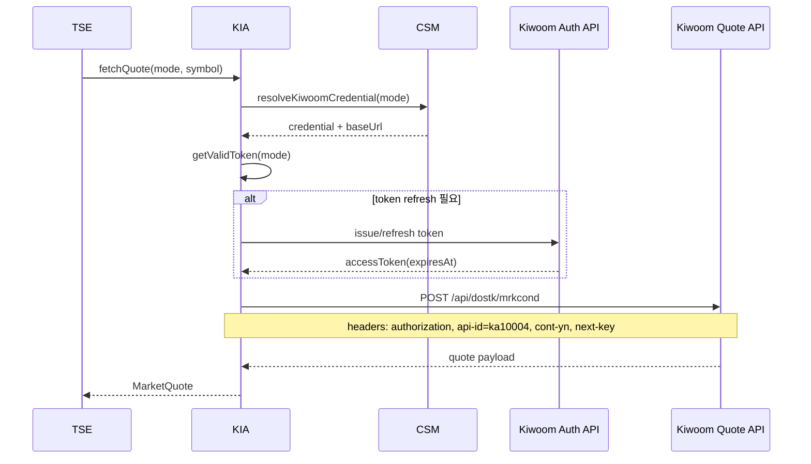
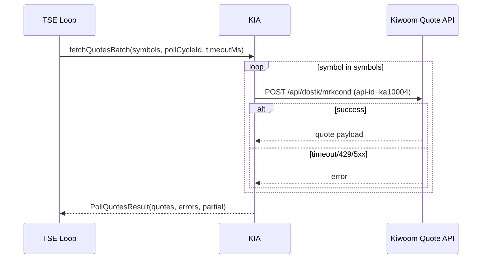
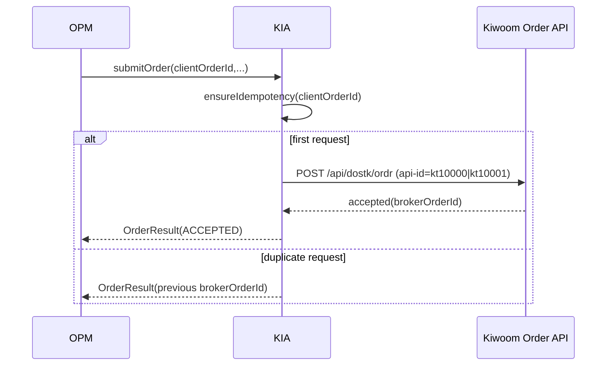
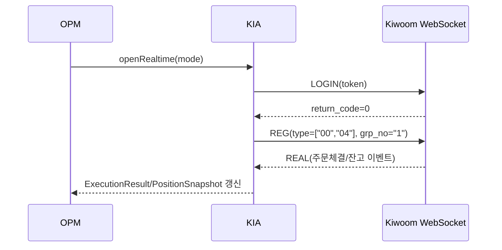

# LLD-KIA v0.1.0

- 문서명: KIA 모듈 저수준 설계서 (LLD)
- 버전: v0.1.0
- 작성일: 2026-02-17
- 기반 문서:
  - `docs/hld/HLD-v0.1.0.md` (특히 4.4, 5, 6, 8)
  - `docs/srs/SRS-v0.1.0.md`
  - `docs/lld/LLD-CSM-v0.1.0.md`
- 모듈: `KIA` (Kiwoom Integration Adapter)

## 1. 모듈 범위와 책임

`KIA`는 키움 REST API 연동을 내부 표준 계약으로 추상화하는 어댑터 모듈이다.

- 인증/시세/주문/체결(잔고 포함) API 캡슐화 (HLD 4.4, SRS 6.1)
- 장중 시세 지속 조회 루프를 위한 배치 시세 조회 계약 제공
- Mock/Live 모드 엔드포인트 라우팅 (HLD 8, SRS FR-014)
- 액세스 토큰 생명주기 관리(발급/갱신/만료 선제 교체)
- 외부 오류를 표준 오류 모델(`code`, `message`, `retryable`, `source`)로 정규화 (HLD 5.1, 6)
- 재시도/백오프 및 주문 멱등성 가이드 제공 (HLD 6.2)

비범위(Out of Scope):
- 전략 판정(TSE), 주문 수량/가격 의사결정(OPM)
- 자격정보 저장/암호화(CSM)
- 리포트 산출(PRP)

## 2. 엔드포인트 추상화

## 2.1 내부 논리 서비스 그룹

- `AuthEndpoint`
  - 토큰 발급/갱신
- `QuoteEndpoint`
  - 시세 조회(공통 URL `/api/dostk/mrkcond`, `api-id=ka*`)
- `OrderEndpoint`
  - 매수/매도/정정/취소 주문(공통 URL `/api/dostk/ordr`, `api-id=kt*`)
- `ExecutionEndpoint`
  - 체결/잔고 이벤트 수집(WebSocket `00`, `04`)
- `RealtimeEndpoint`
  - WebSocket 로그인/등록/해지(`LOGIN` -> `REG/REMOVE`)

## 2.2 모드별 베이스 URL 라우팅

```text
mode=mock(rest) -> https://mockapi.kiwoom.com
mode=live(rest) -> https://api.kiwoom.com
mode=mock(ws)   -> wss://mockapi.kiwoom.com:10000
mode=live(ws)   -> wss://api.kiwoom.com:10000
```

주의:
- 실제 URL 문자열은 `CSM`이 반환하는 런타임 설정을 단일 소스로 사용한다.
- `KIA`는 하드코딩된 모드 분기를 최소화하고 `EndpointResolver`를 통해 결정한다.

## 2.3 EndpointResolver 인터페이스

```text
interface EndpointResolver {
  resolve(mode, serviceType) -> {
    protocol: "REST" | "WEBSOCKET",
    baseUrl: string,
    path: string,
    method: "GET" | "POST"
  }
}
```

## 3. 토큰 라이프사이클 및 갱신 전략

## 3.1 토큰 상태 모델

```json
{
  "accessToken": "<jwt-or-opaque>",
  "issuedAt": "2026-02-17T09:00:00+09:00",
  "expiresAt": "2026-02-17T10:00:00+09:00",
  "refreshAt": "2026-02-17T09:55:00+09:00",
  "scope": "trade quote",
  "mode": "mock"
}
```

규칙:
- `refreshAt = expiresAt - safetyWindow` (기본 300초)
- 호출 시점 `now >= refreshAt`이면 요청 전 선제 갱신
- 401/만료 오류 수신 시 1회 강제 갱신 후 원요청 재시도
- 모드 변경(mock/live) 감지 시 토큰 캐시 폐기 후 재발급

## 3.2 TokenProvider 인터페이스

```text
interface TokenProvider {
  getValidToken(mode) -> AccessToken
  forceRefresh(mode) -> AccessToken
  invalidate(mode) -> void
}
```

## 3.3 동시성 제어

- 동일 모드에서 다중 스레드/루프가 동시에 갱신하지 않도록 단일 비행(single-flight) 락 사용
- 토큰 갱신 중 동일 모드 요청은 대기 후 갱신 결과 재사용

## 4. KIA 표준 계약 (OPM/TSE 사용 인터페이스)

## 4.1 OPM에서 사용하는 계약

### SubmitOrderRequest

```json
{
  "mode": "mock",
  "accountNo": "1234567890",
  "symbol": "005930",
  "side": "BUY",
  "dmstStexTp": "KRX",
  "orderType": "LIMIT",
  "trdeTp": "0",
  "price": 71200,
  "quantity": 10,
  "clientOrderId": "opm-20260217-090501-005930-BUY-01"
}
```

### OrderResult

```json
{
  "brokerOrderId": "A123456789",
  "clientOrderId": "opm-20260217-090501-005930-BUY-01",
  "status": "ACCEPTED",
  "acceptedAt": "2026-02-17T09:05:01+09:00"
}
```

### FetchExecutionRequest / ExecutionResult

```json
{
  "mode": "mock",
  "accountNo": "1234567890",
  "brokerOrderId": "A123456789"
}
```

```json
{
  "brokerOrderId": "A123456789",
  "fills": [
    {
      "executionId": "E10001",
      "price": 71200,
      "quantity": 10,
      "executedAt": "2026-02-17T09:05:02+09:00"
    }
  ],
  "remainingQty": 0
}
```

## 4.2 TSE에서 사용하는 계약

### FetchQuoteRequest / MarketQuote

```json
{
  "mode": "mock",
  "symbol": "005930"
}
```

```json
{
  "symbol": "005930",
  "price": 71000,
  "ask1": 71000,
  "bid1": 70900,
  "tickSize": 100,
  "asOf": "2026-02-17T08:30:00+09:00"
}
```

### PollQuotesRequest / PollQuotesResult (TSE 루프용)

```json
{
  "mode": "mock",
  "symbols": ["005930", "000660"],
  "pollCycleId": "poll-20260217-090510-001",
  "timeoutMs": 700
}
```

```json
{
  "pollCycleId": "poll-20260217-090510-001",
  "quotes": [
    {
      "symbol": "005930",
      "price": 71000,
      "tickSize": 100,
      "asOf": "2026-02-17T09:05:10+09:00"
    }
  ],
  "errors": [
    {
      "symbol": "000660",
      "code": "KIA_API_TIMEOUT",
      "retryable": true
    }
  ],
  "partial": true
}
```

응답 규칙:
- 일부 종목 실패 시 전체 실패로 승격하지 않고 `partial=true`로 반환한다.
- `quotes`는 성공 종목만 포함하며, `errors`는 종목 단위 오류를 포함한다.
- `pollCycleId`는 입력값을 그대로 반영해 TSE가 주기 단위 추적을 할 수 있게 한다.

## 4.3 KIA 제공 인터페이스

```text
interface KiaGateway {
  fetchQuote(req: FetchQuoteRequest) -> MarketQuote
  fetchQuotesBatch(req: PollQuotesRequest) -> PollQuotesResult
  submitOrder(req: SubmitOrderRequest) -> OrderResult
  fetchExecution(req: FetchExecutionRequest) -> ExecutionResult
  fetchPosition(req: FetchPositionRequest) -> PositionSnapshot
}
```

## 5. 오류 모델 표준화

## 5.1 공통 오류 포맷

```json
{
  "code": "KIA_API_TIMEOUT",
  "message": "키움 API 응답 시간이 초과되었습니다.",
  "retryable": true,
  "source": "KIA",
  "details": {
    "service": "QuoteEndpoint",
    "httpStatus": 504,
    "brokerCode": "GW_TIMEOUT"
  }
}
```

## 5.2 오류 매핑 규칙

- HTTP 401/토큰 만료 코드 -> `KIA_AUTH_TOKEN_EXPIRED`, `retryable=true`
- HTTP 403/권한 오류 -> `KIA_AUTH_FORBIDDEN`, `retryable=false`
- HTTP 404/종목 없음 -> `KIA_QUOTE_SYMBOL_NOT_FOUND`, `retryable=false`
- HTTP 409/중복 주문 -> `KIA_ORDER_DUPLICATED`, `retryable=false`
- HTTP 429/호출 제한 -> `KIA_RATE_LIMITED`, `retryable=true`
- HTTP 5xx -> `KIA_UPSTREAM_UNAVAILABLE`, `retryable=true`
- REST Body `return_code != 0` -> 코드 매핑 테이블 우선 적용
- 네트워크 타임아웃/연결 끊김 -> `KIA_API_TIMEOUT`, `retryable=true`
- 파싱 실패/스키마 불일치 -> `KIA_RESPONSE_INVALID`, `retryable=false`
- WebSocket 등록/해지 응답 `return_code != 0` -> `KIA_REALTIME_REGISTER_FAILED`, `retryable=false`

원칙:
- 외부 원문 메시지는 내부 로그에만 제한적으로 저장하고, 상위 모듈에는 정규화 메시지 전달
- 민감정보(토큰/앱키/계좌번호) 로그 출력 금지

## 6. 재시도/백오프 및 멱등성 가이드

## 6.1 재시도 정책

- 대상: `retryable=true` 오류만 재시도
- 기본 횟수: 최대 3회 (최초 호출 + 재시도 2회)
- 백오프: 지수 백오프 + 지터
  - `delayMs = min(baseMs * 2^(attempt-1), maxMs) + jitter(0~100ms)`
  - 기본값: `baseMs=200`, `maxMs=2000`
- 비재시도: 4xx 비즈니스 오류, 유효성 오류, 스키마 오류

## 6.2 주문 멱등성

- `SubmitOrderRequest.clientOrderId`를 필수 멱등 키로 사용
- 동일 `clientOrderId` 재요청 시:
  - 이미 수락된 주문이면 기존 `brokerOrderId` 재반환
  - 상태 미확정이면 주문 조회 후 동일 응답 반환
- OPM은 거래일 단위로 유일한 `clientOrderId`를 생성해야 함

## 6.3 안전한 재시도 경계

- `fetchQuote`, `fetchExecution`, `fetchPosition`은 읽기 요청으로 재시도 허용
- `fetchQuotesBatch`는 읽기 요청으로 재시도 허용하되, 주기 지연 누적 방지를 위해 1회 재시도만 허용
- `submitOrder`는 네트워크 타임아웃 시 무조건 재주문 금지
  - 먼저 `clientOrderId`로 중복조회 수행
  - 미존재가 확인된 경우에만 1회 재제출

## 6.4 시세 루프 호출 제한/부하 제어

- 기본 목표: 초당 1회 주기(`quotePollIntervalMs=1000`) 내 1개 `fetchQuotesBatch` 호출
- 종목 수(1~20) 증가 시 내부 분할 조회가 필요하면 동일 주기 내 순차 호출로 제한하고, 다음 주기로 넘길 수 있다.
- HTTP 429 수신 시 `retry-after`를 우선 적용하고, 해당 주기는 `partial=true`로 종료 가능하다.
- 연속 타임아웃/429 발생은 TSE의 `DEGRADED` 판단 입력이 되도록 오류 코드 그대로 전달한다.

추가 규약:
- 시세/주문 REST는 `POST` 고정이며 TR 식별은 URL이 아니라 `api-id`로 수행한다.
- 연속조회 발생 시 응답 헤더 `cont-yn`, `next-key`를 다음 요청 헤더로 전달한다.

## 7. 모드 라우팅 로직

## 7.1 라우팅 흐름

1) `KIA` 호출 진입
2) `CSM.resolveKiwoomCredential(mode)` 호출로 모드/자격정보/베이스 URL 수신
3) `EndpointResolver.resolve(mode, serviceType)`로 최종 URL 결정
4) 토큰 검증/선제갱신 후 API 호출
5) 응답 역직렬화 및 표준 DTO 반환

## 7.2 모드 변경 반영

- `CSM`에서 모드 변경 이벤트 수신 시 `TokenProvider.invalidate(oldMode)` 수행
- 다음 요청부터 신규 모드 엔드포인트 및 토큰으로 동작

## 8. 시퀀스 다이어그램

## 8.1 시세 조회(토큰 선제 갱신 포함)



## 8.3 배치 시세 조회(루프 1사이클)



## 8.2 주문 제출(멱등키 + 중복 방지)



## 8.4 실시간 체결/잔고 구독



구현 1:1 매핑 경로:

- `gateway.py::DefaultKiaGateway.realtime_login`
- `api_client.py::RoutingKiaApiClient.realtime_login_raw`
- `realtime_client.py::LiveKiaRealtimeClient.login`
- `endpoint_resolver.py::CsmEndpointResolver.resolve(mode, "realtime")`
- `realtime_client.py::LiveKiaRealtimeClient.register/remove`

## 9. 핵심 의사코드

## 9.1 공통 API 호출 래퍼

```text
function callKiwoom(serviceType, mode, request, idempotencyKey?):
  endpoint = endpointResolver.resolve(mode, serviceType)
  cred = csm.resolveKiwoomCredential(mode)

  token = tokenProvider.getValidToken(mode)

  for attempt in [1..3]:
    try:
      response = httpCall(
        url = endpoint.baseUrl + endpoint.path,
        method = "POST",
        headers = buildHeaders(
          token,
          idempotencyKey,
          apiId = resolveApiId(serviceType, request),
          contYn = request.contYn or "N",
          nextKey = request.nextKey or ""
        ),
        body = request
      )
      return mapSuccess(serviceType, response)

    catch err:
      mapped = mapError(err, serviceType)

      if mapped.code == "KIA_AUTH_TOKEN_EXPIRED" and attempt == 1:
        token = tokenProvider.forceRefresh(mode)
        continue

      if mapped.retryable == false:
        throw mapped

      if attempt == 3:
        throw mapped

      sleep(backoffWithJitter(attempt))
```

## 9.2 주문 제출 의사코드(멱등성)

```text
function submitOrder(req):
  require(req.clientOrderId not empty)

  cached = idempotencyStore.find(req.clientOrderId)
  if cached exists:
    return cached

  try:
    result = callKiwoom("OrderEndpoint", req.mode, req, req.clientOrderId)
    idempotencyStore.save(req.clientOrderId, result)
    return result

  catch timeoutErr:
    // 네트워크 불확실성: 재주문 전 원주문 존재 확인
    existing = queryOrderByClientOrderId(req.clientOrderId)
    if existing found:
      idempotencyStore.save(req.clientOrderId, existing)
      return existing
    throw timeoutErr
```

## 10. 운영/관측성(Observability)

- 요청 단위 `traceId`, 주문 단위 `clientOrderId`를 로그 상관키로 사용
- 로그 레벨:
  - `INFO`: 엔드포인트 그룹/지연시간/결과코드
  - `WARN`: 재시도 발생, 429/5xx
  - `ERROR`: 최종 실패 코드
- 로그 금지 필드: `accessToken`, `appKey`, `appSecret`, 전체 계좌번호

## 11. 추적성 매트릭스 (HLD/SRS -> KIA 설계)

| 요구 출처 | 요구 요약 | KIA 설계 반영 |
|---|---|---|
| HLD 4.4 | 인증/시세/주문/체결 캡슐화 | 2장 엔드포인트 추상화, 4장 계약 |
| HLD 5.1 | 공통 오류 모델(`code`,`message`,`retryable`,`source`) | 5장 오류 포맷/매핑 |
| HLD 6.2 | API 재시도, 멱등키 중복 방지 | 6장 재시도/멱등성 |
| HLD 8.1, 8.2 | Mock/Live 모드 정의 및 라우팅 | 2.2, 7장 라우팅 |
| SRS FR-014 | 모의/실전 엔드포인트 라우팅 | 2.2, 7장 |
| SRS 6.1 | 인증/시세/주문/체결 인터페이스 | 2장, 4장 |
| SRS NFR-002 | 민감정보 로그 금지 | 5장 원칙, 10장 |
| SRS NFR-003 | 재시작/복구 시 안정 동작 | 3장 토큰 상태 모델, 6장 안전 재시도 |
| SRS NFR-005 | 추적 가능한 이벤트 로그 | 10장 관측성 |

## 12. 결론

본 LLD-KIA v0.1.0은 HLD 4.4/5/6/8과 SRS 인터페이스/신뢰성/보안 요구를 키움 OpenAPI 실제 프로토콜(REST: `/oauth2/token`, `/api/dostk/mrkcond`, `/api/dostk/ordr` + `api-id`; WebSocket: `/api/dostk/websocket`, `LOGIN/REG/REMOVE`) 기준으로 구현 가능한 수준까지 구체화한다. 구현 단계에서는 `EndpointResolver`, `TokenProvider`, `ErrorMapper`, `IdempotencyStore`, `RealtimeClient`를 우선 개발 대상으로 지정한다.
