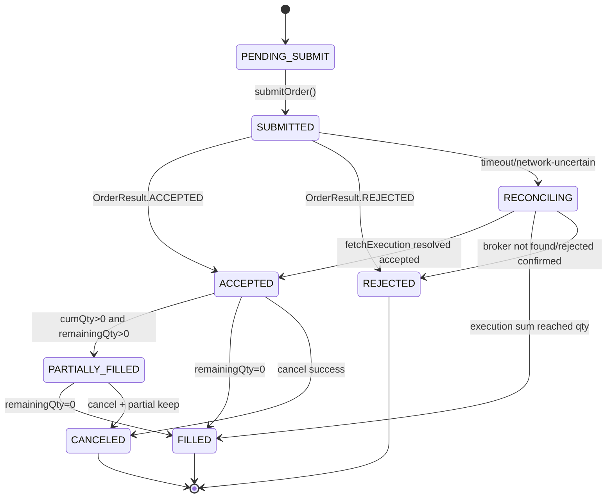
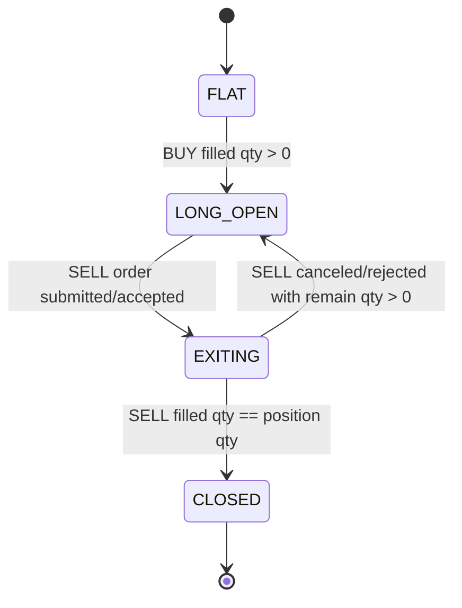
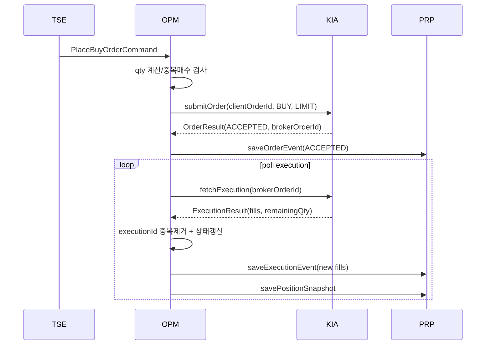
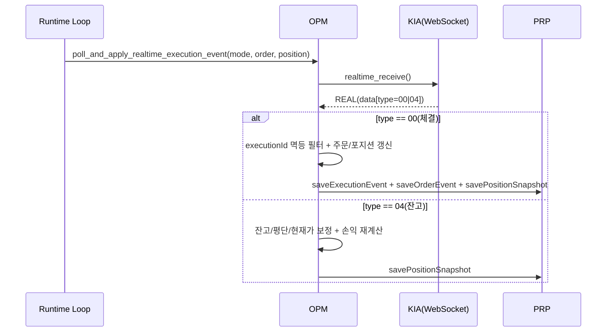
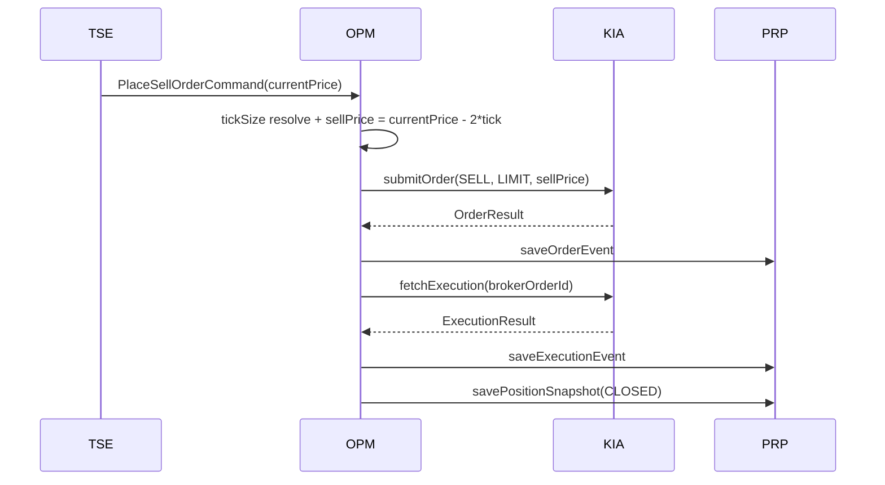
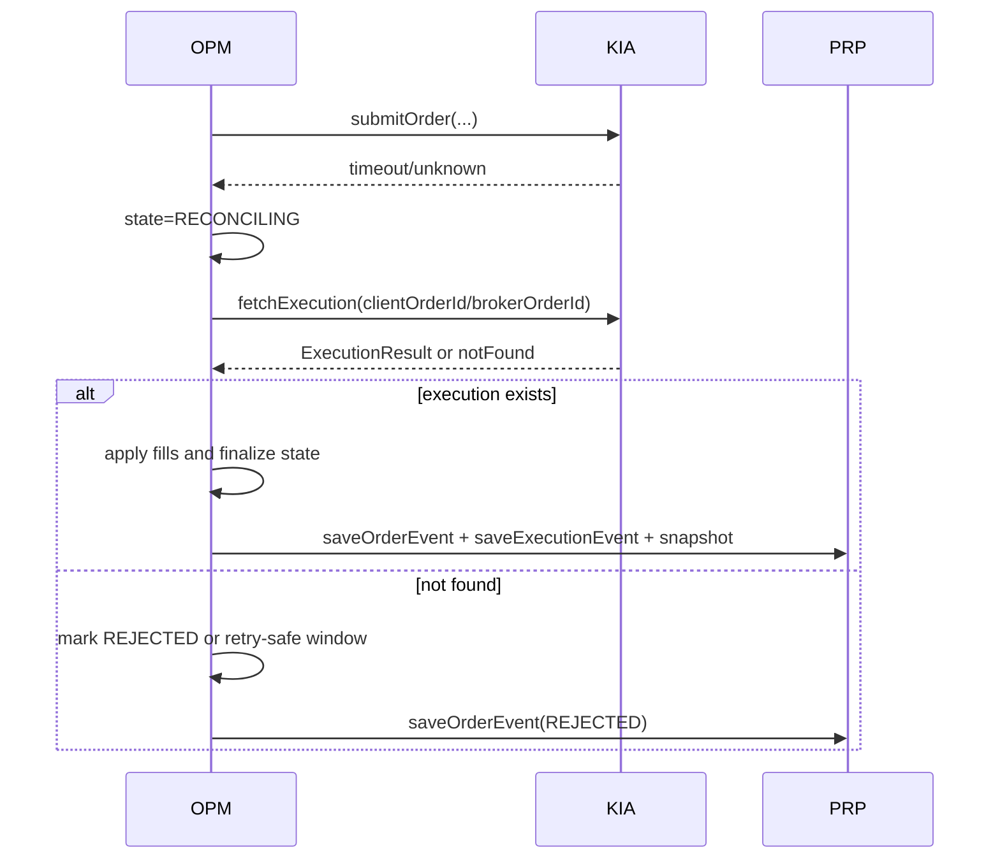

# LLD-OPM v0.1.0

- 문서명: OPM 모듈 저수준 설계서 (LLD)
- 버전: v0.1.0
- 작성일: 2026-02-17
- 기반 문서:
  - `docs/hld/HLD-v0.1.0.md` (특히 4.3, 5, 6)
  - `docs/lld/LLD-KIA-v0.1.0.md`
  - `docs/lld/LLD-PRP-v0.1.0.md`
  - `docs/srs/SRS-v0.1.0.md`
- 모듈: `OPM` (Order & Position Manager)

## 1. 모듈 범위와 책임

`OPM`은 전략 신호를 실제 주문/체결/포지션 상태로 전환하는 실행 중심 모듈이다.

- 매수/매도 주문 생성 및 주문 수명주기 관리 (HLD 4.3)
- 보유 포지션(수량/평단/손익) 상태 관리 (HLD 4.3)
- 매도 주문가 `현재가-2틱` 산정 규칙 적용 (HLD 4.3, SRS FR-011)
- 체결 이벤트 정합화 및 멱등 처리 (HLD 6.2)
- PRP 영속화 이벤트 발행 및 재시작 복구 지원 (HLD 4.6, 6.2)

비범위(Out of Scope):
- 전략 진입/청산 판정 로직(TSE)
- 브로커 API 상세 규격 처리(KIA)
- 리포트 최종 집계(PRP)

## 2. 데이터 모델

## 2.1 OrderAggregate

```json
{
  "orderAggregateId": "opm-20260217-005930-BUY-01",
  "tradingDate": "2026-02-17",
  "symbol": "005930",
  "side": "BUY | SELL",
  "orderType": "LIMIT",
  "requestedPrice": 70600,
  "requestedQty": 14,
  "status": "PENDING_SUBMIT | SUBMITTED | ACCEPTED | PARTIALLY_FILLED | FILLED | REJECTED | CANCELED | RECONCILING",
  "brokerOrderId": "A123456789",
  "cumExecutedQty": 10,
  "avgExecutedPrice": 70580,
  "remainingQty": 4,
  "lastErrorCode": null,
  "lastUpdatedAt": "2026-02-17T09:05:13+09:00"
}
```

## 2.2 PositionModel

```json
{
  "positionId": "pos-20260217-005930",
  "tradingDate": "2026-02-17",
  "symbol": "005930",
  "state": "FLAT | LONG_OPEN | EXITING | CLOSED",
  "quantity": 14,
  "avgBuyPrice": 70610,
  "buyNotional": 988540,
  "sellQuantity": 0,
  "avgSellPrice": 0,
  "sellNotional": 0,
  "currentPrice": 71000,
  "grossInterimPnl": 5460,
  "estimatedSellTax": 1420.00,
  "estimatedSellFee": 98.00,
  "netInterimPnl": 3942.00,
  "currentProfitRate": 0.3986,
  "maxProfitRate": 1.2100,
  "minProfitLocked": false,
  "stateVersion": 18,
  "updatedAt": "2026-02-17T09:10:00+09:00"
}
```

## 2.3 ExecutionLedger (정합/멱등용)

```json
{
  "executionId": "E10001",
  "brokerOrderId": "A123456789",
  "symbol": "005930",
  "side": "BUY",
  "price": 70610,
  "qty": 10,
  "executedAt": "2026-02-17T09:05:13+09:00",
  "source": "KIA.fetchExecution",
  "applied": true
}
```

## 3. 주문 수명주기 상태머신

## 3.1 상태 정의

- `PENDING_SUBMIT`: TSE 신호 수신 후 주문 생성 직후
- `SUBMITTED`: KIA 제출 요청 전송 완료(응답 대기)
- `ACCEPTED`: 브로커 접수 완료
- `PARTIALLY_FILLED`: 부분 체결 진행
- `FILLED`: 주문 수량 전량 체결
- `REJECTED`: 브로커 거부
- `CANCELED`: 취소 완료
- `RECONCILING`: 타임아웃/불확실 상태로 체결 정합 중

## 3.2 전이 규칙



## 3.3 포지션 상태 전이



원칙:
- 단일 종목·단일 포지션(당일 1회 매수/1회 매도) 기준으로 구현한다.
- `LONG_OPEN` 상태에서 추가 매수 신호는 무시하고 `OPM_DUPLICATE_BUY_BLOCKED` 이벤트를 기록한다.

## 4. 가격/틱 규칙: 매도 주문가 = 현재가 - 2틱

## 4.1 KOSPI 호가단위 가정(v0.1.0)

본 문서는 일반 KOSPI 주식 호가단위를 다음과 같이 가정한다.

- `price < 1,000`: tick = 1원
- `1,000 <= price < 5,000`: tick = 5원
- `5,000 <= price < 10,000`: tick = 10원
- `10,000 <= price < 50,000`: tick = 50원
- `50,000 <= price < 100,000`: tick = 100원
- `100,000 <= price < 500,000`: tick = 500원
- `500,000 <= price`: tick = 1,000원

제약:
- ETF/ETN/특례 종목의 예외 호가단위는 v0.1.0 범위 밖으로 두고, KIA가 제공하는 `tickSize`가 있으면 우선 사용한다.

## 4.2 계산식

- `tick = resolveTickSize(currentPrice, market="KOSPI")`
- `rawSellPrice = currentPrice - (2 * tick)`
- `sellPrice = alignToTick(rawSellPrice, tick, direction="down")`
- `sellPrice <= 0`이면 주문 거부 (`OPM_INVALID_SELL_PRICE`)

예시:
- 현재가 71,000원 -> tick 100원 -> 매도가 70,800원
- 현재가 9,980원 -> tick 10원 -> 매도가 9,960원

## 5. 포지션 모델 및 중간 손익(Interim PnL)

## 5.1 기본 수치

- `buyNotional = avgBuyPrice * quantity`
- `markToMarketValue = currentPrice * quantity`
- `grossInterimPnl = markToMarketValue - buyNotional`

## 5.2 추정 비용(중간 손익용)

중간 손익은 미실현 상태에서 추정치로 계산한다.

- `estimatedSellTax = markToMarketValue * taxRate`
- `estimatedSellFee = markToMarketValue * feeRate`
- `netInterimPnl = grossInterimPnl - estimatedSellTax - estimatedSellFee`
- `currentProfitRate(%) = (netInterimPnl / buyNotional) * 100`

보조지표:
- `maxProfitRate = max(maxProfitRate, currentProfitRate)`
- `minProfitLocked = currentProfitRate >= 1.0` (TSE 기준 상태 공유)

정밀도 정책:
- 내부 계산은 Decimal 사용
- 화면/리포트 노출은 소수점 4자리 반올림(LLD-PRP 정합)

## 5.3 매도 체결 후 실현 손익

- `sellNotional = avgSellPrice * soldQty`
- `realizedGrossPnl = sellNotional - buyNotional`
- `realizedNetPnl = realizedGrossPnl - sellTax - sellFee`

## 6. OPM 인터페이스 계약

## 6.1 TSE -> OPM

### PlaceBuyOrderCommand

```json
{
  "commandId": "cmd-20260217-005930-buy-01",
  "tradingDate": "2026-02-17",
  "symbol": "005930",
  "side": "BUY",
  "budget": 1000000,
  "currentPrice": 70600,
  "requestedAt": "2026-02-17T09:05:00+09:00"
}
```

### PlaceSellOrderCommand

```json
{
  "commandId": "cmd-20260217-005930-sell-01",
  "tradingDate": "2026-02-17",
  "symbol": "005930",
  "side": "SELL",
  "currentPrice": 71000,
  "requestedAt": "2026-02-17T10:20:00+09:00"
}
```

## 6.2 OPM -> KIA

`KIA` 계약은 `docs/lld/LLD-KIA-v0.1.0.md` 4장을 따른다.

- `submitOrder(SubmitOrderRequest) -> OrderResult`
- `fetchExecution(FetchExecutionRequest) -> ExecutionResult`
- `fetchPosition(FetchPositionRequest) -> PositionSnapshot`

실시간 수신 범위(코드 반영 기준):
- `realtime_login/realtime_register/realtime_receive/realtime_remove`는 OPM의 체결/잔고 업데이트(type `00`, `04`) 처리에 사용한다.
- `realtime_receive`는 1회 호출당 1개 실시간 payload를 반환하는 폴링 인터페이스로 사용하며, 지속 처리 루프는 상위 오케스트레이션 책임이다.
- 실시간 호가 모니터링(전략 입력용 `QuoteEvent`)은 `TSE`의 시세 폴링 루프(`fetchQuotesBatch`) 경로에서 처리하며 OPM 범위 밖이다.

`SubmitOrderRequest` 생성 규칙:
- `clientOrderId = {tradingDate}-{symbol}-{side}-{seq}`
- 매도는 `price = currentPrice - 2*tick`
- `orderType = LIMIT` 고정(v0.1.0)

## 6.3 OPM -> PRP

`PRP` 계약은 `docs/lld/LLD-PRP-v0.1.0.md` 2장을 따른다.

- `saveOrderEvent(OrderEvent)`
- `saveExecutionEvent(ExecutionEvent)`
- `savePositionSnapshot(PositionSnapshot)`

발행 원칙:
- 상태 전이 시점마다 `OrderEvent` 저장
- 신규 체결 적용 시 `ExecutionEvent` 저장
- 포지션 변경마다 `PositionSnapshot` 저장(`stateVersion` 증가)

## 7. 멱등성 및 체결 정합(Reconciliation)

## 7.1 멱등성 키 전략

- 주문 멱등 키: `clientOrderId`
- 체결 멱등 키: `executionId`
- 스냅샷 버전 키: `(tradingDate, symbol, stateVersion)`

규칙:
- 동일 `clientOrderId` 주문 재요청 시 신규 주문 생성 금지
- 동일 `executionId` 재수신 시 재적용 금지(중복 이벤트는 무시하고 WARN 로그)

## 7.2 체결 정합 알고리즘

정합 트리거:
- 주문 제출 후 응답 타임아웃
- `RECONCILING` 상태 진입
- 재시작 직후 복구

정합 절차:
1) `fetchExecution(brokerOrderId)` 호출
2) `executionId` 기준 신규 체결만 필터링
3) `cumExecutedQty` 재계산
4) 주문 상태를 `PARTIALLY_FILLED`/`FILLED`로 갱신
5) 포지션 수량/평단/손익 갱신
6) PRP에 이벤트/스냅샷 저장
7) 불일치 시 `fetchPosition`으로 브로커 기준 보정

불일치 판정 예:
- 내부 `remainingQty`와 브로커 `remainingQty` 상이
- 내부 누적체결수량 합계와 브로커 `cumQty` 상이

## 7.3 재시작 복구

- `PRP` 최신 `PositionSnapshot` 복원
- 미종결 주문(`SUBMITTED/ACCEPTED/PARTIALLY_FILLED/RECONCILING`) 재조회
- 브로커 체결내역과 병합 후 내부 상태 재구성
- 복구 완료 전 신규 주문 차단 (`OPM_RECOVERY_IN_PROGRESS`)

## 8. 시퀀스 다이어그램

## 8.1 매수 실행 + 체결 반영



## 8.1.1 실시간 체결/잔고 스트림 반영(Realtime type 00/04)



경계 규칙:
- `type=00/04` 외 실시간 타입은 OPM에서 무시하거나 상위 모듈로 전달하지 않는다(v0.1.0).
- 호가 기반 전략 판정은 OPM이 수행하지 않으며, `TSE.onQuote` 입력으로만 처리한다.

## 8.2 매도 실행(현재가-2틱)



## 8.3 타임아웃 후 정합



## 9. 핵심 의사코드

## 9.1 매도 주문가 계산

```text
function resolveSellLimitPrice(currentPrice, tickSizeFromQuote?):
  if currentPrice <= 0:
    raise OPM_INVALID_MARKET_PRICE

  tick = tickSizeFromQuote ?? resolveKospiTick(currentPrice)
  rawSellPrice = currentPrice - (2 * tick)
  sellPrice = floor(rawSellPrice / tick) * tick

  if sellPrice <= 0:
    raise OPM_INVALID_SELL_PRICE

  return sellPrice
```

## 9.2 주문 제출 및 멱등 처리

```text
function submitOrderWithIdempotency(command):
  clientOrderId = buildClientOrderId(command)

  if orderStore.existsByClientOrderId(clientOrderId):
    return orderStore.getByClientOrderId(clientOrderId)

  order = createPendingOrder(command, clientOrderId)
  prp.saveOrderEvent(order.toEvent("PENDING_SUBMIT"))

  try:
    result = kia.submitOrder(toSubmitOrderRequest(order))
    order.applyResult(result)
    prp.saveOrderEvent(order.toEvent(order.status))
    return order

  catch timeoutOrUnknown:
    order.markReconciling("OPM_ORDER_SUBMIT_TIMEOUT")
    prp.saveOrderEvent(order.toEvent("RECONCILING"))
    enqueueReconciliation(order)
    return order
```

## 9.3 체결 반영 및 중복 제거

```text
function applyExecutionResult(order, executionResult):
  for fill in executionResult.fills:
    if executionLedger.contains(fill.executionId):
      continue

    executionLedger.add(fill.executionId)
    order.addFill(fill.price, fill.quantity)
    position.applyFill(order.side, fill.price, fill.quantity)

    prp.saveExecutionEvent(toExecutionEvent(order, fill))

  order.syncRemaining(executionResult.remainingQty)
  order.deriveStatus()
  position.recalculateInterimPnl(latestMarketPrice)

  prp.saveOrderEvent(order.toEvent(order.status))
  prp.savePositionSnapshot(position.toSnapshot())
```

## 10. 오류 처리 및 재시도 정책

## 10.1 오류 분류

- `OPM_VALIDATION_*`: 입력/상태 유효성 오류 (재시도 불가)
- `OPM_KIA_RETRYABLE`: KIA `retryable=true` 전파 (재시도 가능)
- `OPM_KIA_NON_RETRYABLE`: 주문 거부/권한 오류 (재시도 불가)
- `OPM_RECONCILIATION_FAILED`: 정합 실패 (수동 확인 필요)
- `OPM_PRP_WRITE_FAILED`: 영속화 실패 (제한적 재시도)

## 10.2 재시도 원칙

- OPM 직접 재시도 대상:
  - `fetchExecution`, `fetchPosition` 조회성 호출
  - PRP 저장 일시 실패
- OPM 직접 재시도 금지 대상:
  - `submitOrder` 타임아웃 이후 즉시 재주문

실행 규칙:
- 조회/저장 재시도: 최대 3회, 지수 백오프(200ms, 400ms, 800ms)
- 주문 제출 타임아웃: `RECONCILING` 전환 후 정합 절차로만 처리
- 재시도 소진 시 오류 이벤트 저장 + UI 알림 코드 노출

## 10.3 장애 내성

- PRP 저장 실패 시 메모리 큐에 임시 적재 후 재플러시
- 재시작 시 미반영 큐가 있으면 먼저 PRP 반영 후 거래 루프 시작
- 복구가 완료되기 전 신규 주문을 거부하여 중복 리스크를 방지

## 11. 추적성 매트릭스

| 요구사항 출처 | 요구 내용 | OPM 설계 반영 섹션 |
|---|---|---|
| HLD 4.3 | 주문 수명주기 관리 | 3장, 8.1~8.3, 9.2~9.3 |
| HLD 4.3 | 포지션/평단/수익률 상태 관리 | 2.2, 5장, 9.3 |
| HLD 4.3 / SRS FR-011 | 매도 주문가 현재가-2틱 | 4장, 8.2, 9.1 |
| HLD 5.2 | OPM-KIA/PRP 인터페이스 계약 | 6장 |
| HLD 6.2 | 주문 멱등 키 기반 중복 방지 | 7.1, 9.2 |
| HLD 6.2 | 재시작 후 체결/잔고 재동기화 | 7.2, 7.3 |
| HLD 6 | 오류/복구/재시도 전략 | 10장 |
| SRS NFR-003 | 재시작 복구 가능 | 7.3, 10.3 |
| SRS NFR-004 | 계산 일관성 | 5장(Decimal/반올림 규칙) |
| SRS NFR-005 | 이벤트 감사 가능 저장 | 6.3, 7장, 10장 |

## 12. 구현 체크리스트

- [ ] 주문/포지션 상태 enum 및 전이 검증기 구현
- [ ] KOSPI 틱 계산기 + 현재가-2틱 유틸 구현
- [ ] `clientOrderId` 생성기 및 중복 차단 저장소 구현
- [ ] executionId 기반 중복 제거 ledger 구현
- [ ] RECONCILING 워커(주기 정합 루프) 구현
- [ ] PRP 이벤트/스냅샷 발행 연결
- [ ] 재시작 복구 시퀀스(스냅샷->체결재조회->상태재구성) 구현

---
본 문서는 HLD v0.1.0의 OPM 책임(주문·포지션·2틱 매도·정합·복구)을 구현 가능한 수준으로 상세화한 저수준 설계서이다.
