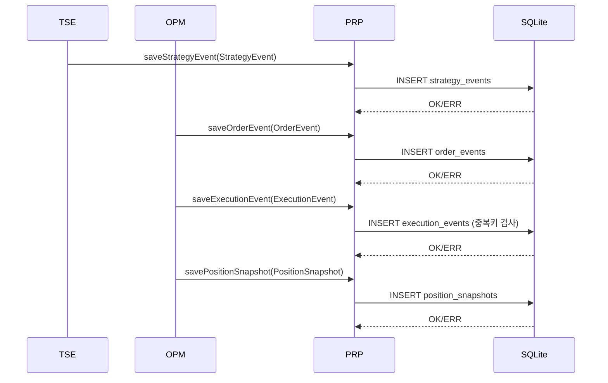
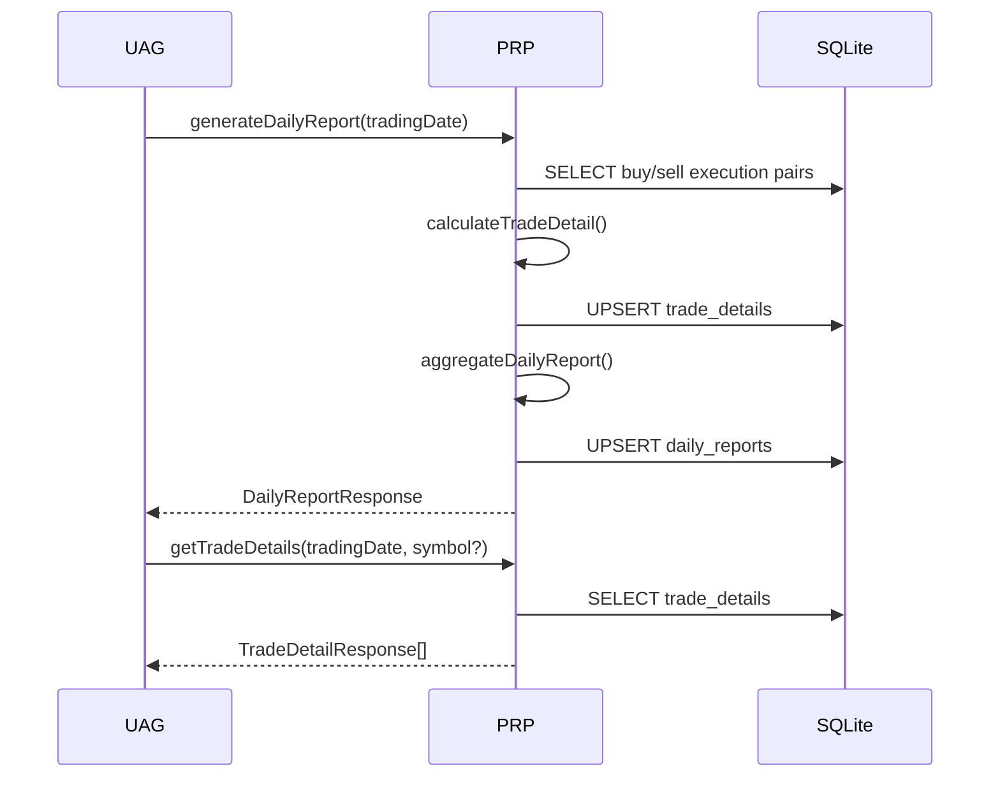

# LLD-PRP v0.1.0

- 문서명: PRP 모듈 저수준 설계서 (LLD)
- 버전: v0.1.0
- 작성일: 2026-02-17
- 기반 문서:
  - `docs/hld/HLD-v0.1.0.md` (특히 4.6, 5)
  - `docs/srs/SRS-v0.1.0.md`
- 모듈: `PRP` (Persistence & Reporting)

## 1. 모듈 범위와 책임

`PRP`는 자동매매 런타임 데이터의 영속화와 리포트 집계를 담당한다.

- 주문/체결/전략 이벤트 영속화 (HLD 4.6, SRS NFR-005)
- 재시작 복구용 상태 스냅샷 저장/복원 (HLD 4.6, SRS NFR-003)
- 일자별 리포트 계산/조회 (HLD 4.6, SRS FR-016, FR-017, NFR-004)
- `UAG` 조회용 DTO 응답 제공 (HLD 5.2)

비범위(Out of Scope):
- 전략 판정 로직 자체(TSE 책임)
- 주문 실행/체결 조회 API 호출(KIA/OPM 책임)

## 2. 인터페이스 정의 (DTO)

모든 수치 필드는 계산 일관성(NFR-004)을 위해 Decimal 기반으로 처리한다.

### 2.1 입력 이벤트 DTO

#### StrategyEvent
```json
{
  "eventId": "uuid",
  "occurredAt": "2026-02-17T09:05:10+09:00",
  "tradingDate": "2026-02-17",
  "symbol": "005930",
  "eventType": "BUY_CANDIDATE_ENTERED | LOCAL_LOW_UPDATED | BUY_SIGNAL | MIN_PROFIT_LOCKED | SELL_SIGNAL",
  "basePrice": 71200.00,
  "localLow": 70480.00,
  "currentPrice": 70630.00,
  "payload": {
    "reboundRate": 0.2128,
    "currentProfitRate": 1.034,
    "maxProfitRate": 1.210,
    "profitPreservationRate": 85.45
  }
}
```

#### OrderEvent
```json
{
  "eventId": "uuid",
  "orderId": "KIW-20260217-00001",
  "occurredAt": "2026-02-17T09:05:12+09:00",
  "tradingDate": "2026-02-17",
  "symbol": "005930",
  "side": "BUY | SELL",
  "orderType": "LIMIT",
  "orderPrice": 70620.00,
  "quantity": 14,
  "status": "SUBMITTED | ACCEPTED | REJECTED | CANCELED",
  "clientOrderKey": "20260217-005930-BUY-1",
  "reasonCode": null,
  "reasonMessage": null
}
```

#### ExecutionEvent
```json
{
  "eventId": "uuid",
  "executionId": "EXE-889977",
  "orderId": "KIW-20260217-00001",
  "occurredAt": "2026-02-17T09:05:13+09:00",
  "tradingDate": "2026-02-17",
  "symbol": "005930",
  "side": "BUY | SELL",
  "executionPrice": 70610.00,
  "executionQty": 14,
  "cumQty": 14,
  "remainingQty": 0
}
```

#### PositionSnapshot
```json
{
  "snapshotId": "uuid",
  "savedAt": "2026-02-17T10:10:01+09:00",
  "tradingDate": "2026-02-17",
  "symbol": "005930",
  "avgBuyPrice": 70610.00,
  "quantity": 14,
  "currentProfitRate": 1.12,
  "maxProfitRate": 1.34,
  "minProfitLocked": true,
  "lastOrderId": "KIW-20260217-00001",
  "stateVersion": 18
}
```

### 2.2 조회 요청/응답 DTO

#### GetDailyReportQuery
```json
{
  "tradingDate": "2026-02-17"
}
```

#### DailyReportResponse
```json
{
  "tradingDate": "2026-02-17",
  "totalBuyAmount": 988540.00,
  "totalSellAmount": 1002130.00,
  "totalSellTax": 2004.26,
  "totalSellFee": 110.23,
  "totalNetPnl": 11475.51,
  "totalReturnRate": 1.1608,
  "generatedAt": "2026-02-17T15:31:00+09:00"
}
```

#### GetTradeDetailsQuery
```json
{
  "tradingDate": "2026-02-17",
  "symbol": "005930"
}
```

#### TradeDetailResponse
```json
{
  "tradingDate": "2026-02-17",
  "symbol": "005930",
  "buyExecutedAt": "2026-02-17T09:05:13+09:00",
  "sellExecutedAt": "2026-02-17T10:22:40+09:00",
  "quantity": 14,
  "buyPrice": 70610.00,
  "sellPrice": 71580.00,
  "buyAmount": 988540.00,
  "sellAmount": 1002120.00,
  "sellTax": 2004.24,
  "sellFee": 110.23,
  "netPnl": 11465.53,
  "returnRate": 1.1600
}
```

### 2.3 공통 오류 응답 DTO

```json
{
  "code": "PRP_DB_WRITE_FAILED",
  "message": "이벤트 저장에 실패했습니다.",
  "retryable": true,
  "source": "PRP"
}
```

## 3. 저장소 선택 및 스키마

### 3.1 선택: SQLite

선택 기술: 로컬 SQLite (`runtime/state/prp.db`)

선정 근거:
- 이벤트/스냅샷/리포트를 단일 파일 DB로 원자적 트랜잭션 처리 가능
- 재시작 복구 시 최신 스냅샷 + 누적 이벤트 조회가 JSON 파일 다건 처리보다 단순
- FR-017 일자/종목 기준 조회에 인덱스 최적화 가능
- 개인 PC 단일 프로세스 운영 가정에서 운영 복잡도 낮음

### 3.2 물리 스키마

#### table: strategy_events
- `event_id TEXT PRIMARY KEY`
- `trading_date TEXT NOT NULL`
- `occurred_at TEXT NOT NULL`
- `symbol TEXT NOT NULL`
- `event_type TEXT NOT NULL`
- `base_price NUMERIC NULL`
- `local_low NUMERIC NULL`
- `current_price NUMERIC NULL`
- `payload_json TEXT NULL`

Index:
- `idx_strategy_events_date_symbol (trading_date, symbol, occurred_at)`

#### table: order_events
- `event_id TEXT PRIMARY KEY`
- `order_id TEXT NOT NULL`
- `trading_date TEXT NOT NULL`
- `occurred_at TEXT NOT NULL`
- `symbol TEXT NOT NULL`
- `side TEXT NOT NULL`
- `order_type TEXT NOT NULL`
- `order_price NUMERIC NOT NULL`
- `quantity INTEGER NOT NULL`
- `status TEXT NOT NULL`
- `client_order_key TEXT NOT NULL`
- `reason_code TEXT NULL`
- `reason_message TEXT NULL`

Unique:
- `uk_order_events_orderid_status (order_id, status, occurred_at)`

#### table: execution_events
- `event_id TEXT PRIMARY KEY`
- `execution_id TEXT NOT NULL`
- `order_id TEXT NOT NULL`
- `trading_date TEXT NOT NULL`
- `occurred_at TEXT NOT NULL`
- `symbol TEXT NOT NULL`
- `side TEXT NOT NULL`
- `execution_price NUMERIC NOT NULL`
- `execution_qty INTEGER NOT NULL`
- `cum_qty INTEGER NOT NULL`
- `remaining_qty INTEGER NOT NULL`

Unique:
- `uk_execution_events_executionid (execution_id)`

#### table: position_snapshots
- `snapshot_id TEXT PRIMARY KEY`
- `saved_at TEXT NOT NULL`
- `trading_date TEXT NOT NULL`
- `symbol TEXT NOT NULL`
- `avg_buy_price NUMERIC NOT NULL`
- `quantity INTEGER NOT NULL`
- `current_profit_rate NUMERIC NOT NULL`
- `max_profit_rate NUMERIC NOT NULL`
- `min_profit_locked INTEGER NOT NULL`
- `last_order_id TEXT NULL`
- `state_version INTEGER NOT NULL`

Index:
- `idx_position_snapshots_date_savedat (trading_date, saved_at DESC)`

#### table: daily_reports
- `trading_date TEXT PRIMARY KEY`
- `total_buy_amount NUMERIC NOT NULL`
- `total_sell_amount NUMERIC NOT NULL`
- `total_sell_tax NUMERIC NOT NULL`
- `total_sell_fee NUMERIC NOT NULL`
- `total_net_pnl NUMERIC NOT NULL`
- `total_return_rate NUMERIC NOT NULL`
- `generated_at TEXT NOT NULL`

#### table: trade_details
- `id TEXT PRIMARY KEY`
- `trading_date TEXT NOT NULL`
- `symbol TEXT NOT NULL`
- `buy_executed_at TEXT NOT NULL`
- `sell_executed_at TEXT NOT NULL`
- `quantity INTEGER NOT NULL`
- `buy_price NUMERIC NOT NULL`
- `sell_price NUMERIC NOT NULL`
- `buy_amount NUMERIC NOT NULL`
- `sell_amount NUMERIC NOT NULL`
- `sell_tax NUMERIC NOT NULL`
- `sell_fee NUMERIC NOT NULL`
- `net_pnl NUMERIC NOT NULL`
- `return_rate NUMERIC NOT NULL`

Index:
- `idx_trade_details_date_symbol (trading_date, symbol)`

## 4. 시퀀스 플로우

### 4.1 이벤트 영속화 시퀀스



오류 처리:
- `INSERT` 실패 시 공통 오류 모델 반환 (`retryable` 판정 포함)
- 멱등성 충돌(중복 execution/order)은 WARN 로그 후 성공으로 간주(중복 수신 허용)

### 4.2 리포트 생성/조회 시퀀스



## 5. 리포트 계산식

SRS FR-016 고정값을 사용한다.

- 매수금액: `buyAmount = buyPrice * quantity`
- 매도금액: `sellAmount = sellPrice * quantity`
- 세금(매도): `sellTax = sellAmount * 0.002` (0.2%)
- 매도수수료: `sellFee = sellAmount * 0.00011` (0.011%)
- 순손익: `netPnl = sellAmount - buyAmount - sellTax - sellFee`
- 수익률(%): `returnRate = (netPnl / buyAmount) * 100`

일자 집계:
- `totalBuyAmount = Σ buyAmount`
- `totalSellAmount = Σ sellAmount`
- `totalSellTax = Σ sellTax`
- `totalSellFee = Σ sellFee`
- `totalNetPnl = Σ netPnl`
- `totalReturnRate = (totalNetPnl / totalBuyAmount) * 100`

반올림 규칙(v0.1.0):
- 금액: 소수점 둘째 자리 `ROUND_HALF_UP`
- 수익률: 소수점 넷째 자리 `ROUND_HALF_UP`

## 6. 재시작 복구 프로세스 (의사코드)

```text
function recoverOnStartup(tradingDate):
    open sqlite connection

    settings = CSM.loadRuntimeSettings()
    lastSnapshot = PRP.findLatestSnapshot(tradingDate)

    if lastSnapshot exists:
        OPM.restorePosition(lastSnapshot)
        TSE.restoreStateFromSnapshot(lastSnapshot)
    else:
        OPM.initEmptyPosition()
        TSE.initDayState()

    # 외부 정합성 재동기화
    externalExecutions = KIA.fetchExecutions(tradingDate)
    for each execution in externalExecutions:
        if not PRP.existsExecution(execution.executionId):
            PRP.saveExecutionEvent(execution)

    OPM.rebuildPositionFromExecutions(tradingDate)
    TSE.recalculateDerivedFlags(OPM.currentPosition)

    PRP.writeRecoveryLog(tradingDate, "RECOVERY_COMPLETED")
    return SUCCESS
```

복구 원칙:
- 스냅샷 우선 복원 후 체결 재동기화(HLD 6.2)
- 중복 체결은 `execution_id` 고유키로 차단
- 복구 완료 이벤트를 감사로그에 기록(NFR-005)

## 7. 제약사항 및 오류 처리

### 7.1 제약사항
- 단일 로컬 프로세스 writer를 가정한다.
- 거래일 키는 로컬 시간대 `Asia/Seoul` 기준이다.
- 전략 파라미터(1%, 0.2%, 1%, 80%, -2틱)는 PRP에서 수정하지 않는다.

### 7.2 오류 분류
- `PRP_DB_WRITE_FAILED`: DB 쓰기 실패, `retryable=true`
- `PRP_DB_READ_FAILED`: DB 읽기 실패, `retryable=true`
- `PRP_INVALID_QUERY`: 조회 파라미터 오류, `retryable=false`
- `PRP_REPORT_CALC_FAILED`: 계산 입력 불충분(매수/매도 쌍 불일치), `retryable=false`
- `PRP_SCHEMA_MISMATCH`: 스키마 버전 불일치, `retryable=false`

### 7.3 처리 정책
- 영속화 실패: 최대 3회 재시도(지수 백오프), 이후 상위 모듈에 장애 전파
- 조회 실패: 사용자 메시지에 민감정보 없이 오류코드만 노출
- 부분 집계 실패: 거래 상세 생성 실패 건 제외 후 실패 건수와 함께 결과 반환

## 8. 추적성 매트릭스 (HLD/SRS)

| LLD 항목 | HLD 추적 | SRS 추적 |
|---|---|---|
| PRP 책임 정의 | 4.6 | FR-016, FR-017, NFR-003, NFR-005 |
| 모듈 간 DTO 계약 | 5.1, 5.2 | FR-017, NFR-001 |
| 오류 공통 모델 준수 | 5.1, 6.1 | NFR-002 |
| 이벤트 영속화 | 4.6, 6.2 | NFR-005 |
| 재시작 복구 | 4.6, 6.2 | NFR-003 |
| 리포트 계산식 | 5.3 | FR-016, NFR-004, AC-008 |
| 일자/상세 조회 | 5.2 | FR-017 |

## 9. 구현 체크리스트

- [ ] SQLite 파일 경로 및 초기 스키마 마이그레이션 적용
- [ ] 이벤트/스냅샷 저장 API 구현
- [ ] 리포트 생성 배치/온디맨드 API 구현
- [ ] 복구 루틴 구현 및 재시작 테스트
- [ ] 계산 반올림 규칙 단위 테스트 추가
