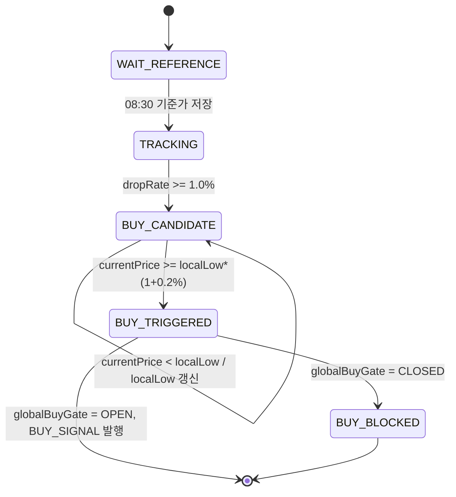
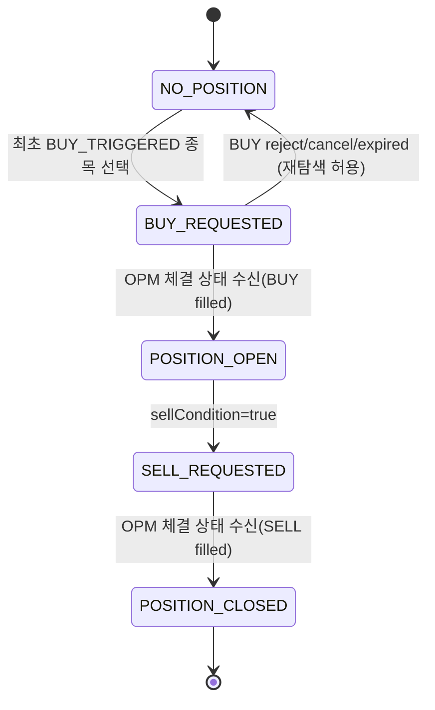

# LLD-TSE v0.1.0

- 문서명: TSE 모듈 저수준 설계서 (LLD)
- 버전: v0.1.0
- 작성일: 2026-02-17
- 기반 문서:
  - `docs/hld/HLD-v0.1.0.md` (특히 4.2, 5)
  - `docs/srs/SRS-v0.1.0.md`
  - `docs/lld/LLD-OPM-v0.1.0.md`
  - `docs/lld/LLD-PRP-v0.1.0.md`
- 모듈: `TSE` (Trading Strategy Engine)

## 1. 모듈 범위와 책임

`TSE`는 전략 판정 전용 모듈로서, 시세/포지션 입력을 상태머신으로 해석하여 매수/매도 신호를 생성한다.

- 08:30 기준가 1회 확정 (SRS FR-002)
- 기준가 대비 1% 하락 감지 및 매수 후보 전환 (SRS FR-003)
- 후보 상태에서 전저점 지속 추적 (SRS FR-004)
- 전저점 대비 0.2% 반등 매수 신호 판정 (SRS FR-005)
- 감시 1~20 종목 중 최초 충족 1개 전액 매수 신호만 허용 (SRS FR-006, FR-007)
- 매수 후 +1% 최소수익 확보 전환 및 최고수익률 추적 (SRS FR-008, FR-009)
- 이익보전율 80% 이하 매도 신호 판정 (SRS FR-010)
- 전략 이벤트를 PRP로 기록 요청 (HLD 5.2, SRS NFR-005)
- 장중 시세 지속 조회 루프를 오케스트레이션하고 시세 이벤트를 상태머신 입력으로 공급

비범위(Out of Scope):
- 주문 수량 산정/제출/체결 정합(OPM)
- 브로커 API 호출(KIA)
- 리포트 최종 집계(PRP)

## 1.1 시세 지속 조회 루프(필수 런타임)

`TSE`는 거래가 실행 중인 동안 종료 신호를 받기 전까지 시세 조회 루프를 유지한다.

- 루프 시작: `StartTradingCommand`
- 루프 종료: `StopTradingCommand`, 거래일 종료, 치명 오류
- 루프 호출 대상: `KIA.fetchQuotesBatch(PollQuotesRequest)`
- 루프 출력: 종목별 `MarketQuote`를 생성해 `onQuote`에 순차 전달
- 루프 상태:
  - `RUNNING`: 정상 주기 실행
  - `DEGRADED`: 연속 실패 임계치 초과(신규 BUY 신호 차단)
  - `STOPPED`: 수동/정상 종료

기본 파라미터(v0.1.0):
- `quotePollIntervalMs = 1000`
- `quotePollTimeoutMs = 700`
- `quoteConsecutiveErrorThreshold = 3`
- `quoteRecoverySuccessThreshold = 2`

운영 규칙:
- 루프 주기 내 배치 조회를 우선하며, 부분 실패 시 성공 종목만 계속 처리한다.
- `DEGRADED` 상태에서는 매도/리스크 관리 입력은 유지하되 신규 매수 진입(`BUY_SIGNAL`)은 차단한다.
- 성공 응답이 연속 임계치를 충족하면 자동으로 `RUNNING` 복귀한다.

## 1.2 코드 기준 반영 설계(2026-02-18)

현재 코드베이스 기준으로 역할을 다음처럼 명확히 분리한다.

- `OPM.poll_realtime_execution_event()`의 `realtime_receive`는 **체결/잔고 실시간(type `00`, `04`) 전용**으로 사용한다.
- `TSE.on_quote()` 입력은 **호가 배치 폴링 결과(`fetchQuotesBatch`)**에서 생성한다.
- 호가 모니터링은 독립 오케스트레이터(`QuoteMonitoringLoop`)가 담당하고, `TSE`는 상태머신 평가에 집중한다.

설계 의도:
- 체결/잔고 스트림과 호가 모니터링 책임을 분리해 장애 영향 범위를 축소한다.
- 호가 루프 실패(`DEGRADED`)와 체결 스트림 실패를 서로 다른 복구 경로로 관리한다.
- 기존 `TSE` 상태머신/규칙 구현을 변경하지 않고 입력 공급 계층만 강화한다.

## 2. 전략 상수와 계산식

## 2.1 고정 파라미터(v0.1.0)

- `REFERENCE_CAPTURE_TIME = 08:30:00` (로컬 서버 시각)
- `DROP_THRESHOLD_PCT = 1.0`
- `REBOUND_THRESHOLD_PCT = 0.2`
- `MIN_PROFIT_LOCK_PCT = 1.0`
- `PROFIT_PRESERVATION_SELL_PCT = 80.0`
- `MAX_WATCH_SYMBOLS = 20`

## 2.2 계산식

- 하락률: `dropRate = (basePrice - currentPrice) / basePrice * 100`
- 반등률: `reboundRate = (currentPrice - localLow) / localLow * 100`
- 평가수익률: `currentProfitRate = (currentPrice - avgBuyPrice) / avgBuyPrice * 100`
- 이익보전율: `profitPreservationRate = (currentProfitRate / maxProfitRate) * 100`

계산 제약:
- `basePrice > 0`, `localLow > 0`, `avgBuyPrice > 0`에서만 계산
- `maxProfitRate > 0`이고 `minProfitLocked=true`일 때만 이익보전율 계산
- 내부 계산은 Decimal, 비교는 소수점 오차 허용치 `EPS=0.0001` 적용

## 3. 상태머신 설계

## 3.1 종목 단위 상태머신 (매수 전)

상태 정의:
- `WAIT_REFERENCE`: 08:30 기준가 확정 대기
- `TRACKING`: 기준가 확정 후 일반 감시
- `BUY_CANDIDATE`: 1% 이상 하락 감지 후 전저점 추적
- `BUY_TRIGGERED`: 0.2% 반등 조건 충족(전역 게이트 승인이 필요)
- `BUY_BLOCKED`: 전역 단일매수 제약으로 신호 차단



전이 규칙:
- 08:30 이전에는 어떤 하락/반등 신호도 평가하지 않는다.
- `BUY_CANDIDATE` 진입 시 `localLow = currentPrice`로 초기화한다.
- `BUY_CANDIDATE` 동안 더 낮은 가격이 나오면 즉시 `localLow`를 갱신한다.
- 반등 판정은 항상 최신 `localLow`를 기준으로 계산한다.

## 3.2 포트폴리오 단위 상태머신 (단일 전액매수 제약)

상태 정의:
- `NO_POSITION`: 당일 미매수 상태
- `BUY_REQUESTED`: OPM에 전액 매수 신호를 1회 발행한 상태
- `POSITION_OPEN`: 매수 체결 확인 후 보유 상태
- `SELL_REQUESTED`: 매도 신호 발행 상태
- `POSITION_CLOSED`: 매도 체결 완료 상태



전역 게이트(`globalBuyGate`) 규칙:
- `NO_POSITION`에서만 `OPEN`
- `BUY_REQUESTED` 이후 즉시 `CLOSED`로 전환
- 동일 거래일에 두 번째 `BUY_SIGNAL`은 항상 차단(노-더블-바이)

## 3.3 매수 후 수익 보호 상태

`POSITION_OPEN` 내부 서브상태:
- `PROFIT_UNLOCKED`: `currentProfitRate < 1.0%`
- `PROFIT_LOCKED`: `currentProfitRate >= 1.0%` 최초 도달 이후 유지

매도 조건:
- `PROFIT_LOCKED=true`이고 `profitPreservationRate <= 80.0`이면 `SELL_SIGNAL`
- `SELL_SIGNAL`은 포지션당 1회만 발행

## 4. 시간 경계와 거래일 규칙

- 감시 대상 종목 수는 1~20개 범위여야 한다.
- 기준가 캡처는 거래일당 종목별 1회만 허용한다.
- 08:30 이전(`HH:MM:SS < 08:30:00`)에는 매수 상태머신을 진행하지 않는다.
- 거래일 경계(날짜 변경) 시 모든 종목 상태와 전역 게이트를 초기화한다.
- `BUY_REQUESTED` 이후 같은 거래일에는 추가 매수 신호를 발행하지 않는다.
- 매수 실패(거부/취소/미체결 만료)가 확정되면 전역 게이트를 재개방하여 재탐색을 허용한다.

## 5. 인터페이스 계약

## 5.1 입력 계약

### KIA/마켓데이터 경유 시세 이벤트 (TSE 입력)

```json
{
  "tradingDate": "2026-02-17",
  "occurredAt": "2026-02-17T09:05:10+09:00",
  "pollCycleId": "poll-20260217-090510-001",
  "sequence": 12,
  "symbol": "005930",
  "currentPrice": 70630.00
}
```

### OPM 포지션 업데이트 이벤트 (TSE 입력)

```json
{
  "tradingDate": "2026-02-17",
  "symbol": "005930",
  "positionState": "BUY_REQUESTED | LONG_OPEN | SELL_REQUESTED | CLOSED",
  "avgBuyPrice": 70610.00,
  "currentProfitRate": 1.034,
  "maxProfitRate": 1.210,
  "minProfitLocked": true,
  "updatedAt": "2026-02-17T10:10:00+09:00"
}
```

## 5.2 TSE -> OPM 명령 계약

### PlaceBuyOrderCommand

```json
{
  "commandId": "cmd-20260217-005930-buy-01",
  "tradingDate": "2026-02-17",
  "symbol": "005930",
  "side": "BUY",
  "budgetPolicy": "ALL_IN",
  "signalPrice": 70630.00,
  "orderPrice": 70830.00,
  "reasonCode": "TSE_REBOUND_BUY_SIGNAL",
  "requestedAt": "2026-02-17T09:05:10+09:00"
}
```

- BUY 주문 가격 규칙: `orderPrice = currentPrice`에서 시작해 호가단위를 1틱씩 2회 가산한 값(`현재가+2틱`)

### PlaceSellOrderCommand

```json
{
  "commandId": "cmd-20260217-005930-sell-01",
  "tradingDate": "2026-02-17",
  "symbol": "005930",
  "side": "SELL",
  "currentPrice": 71580.00,
  "reasonCode": "TSE_PROFIT_PRESERVATION_BREAK",
  "requestedAt": "2026-02-17T10:22:00+09:00"
}
```

## 5.3 TSE -> PRP 이벤트 계약

`StrategyEvent`(LLD-PRP 2.1) 사용:

- `BUY_CANDIDATE_ENTERED`
- `LOCAL_LOW_UPDATED`
- `BUY_SIGNAL`
- `MIN_PROFIT_LOCKED`
- `SELL_SIGNAL`

추가 payload 규칙:
- `BUY_CANDIDATE_ENTERED`: `dropRate`, `basePrice`, `currentPrice`
- `LOCAL_LOW_UPDATED`: `previousLow`, `newLow`
- `BUY_SIGNAL`: `localLow`, `currentPrice`, `reboundRate`, `rank`
- `MIN_PROFIT_LOCKED`: `currentProfitRate`, `maxProfitRate`
- `SELL_SIGNAL`: `currentProfitRate`, `maxProfitRate`, `profitPreservationRate`

## 6. 다중 종목 동시성 및 우선순위

매수 트리거가 같은 시점에 복수 종목에서 발생할 수 있으므로 다음 순서로 1개를 선택한다.

1) `occurredAt`이 가장 빠른 종목
2) 동일 시각이면 시세 수신 순서(sequence)가 빠른 종목
3) 그래도 동일하면 감시목록 입력 순서가 앞선 종목

선택 결과:
- 선택된 1개 종목만 `PlaceBuyOrderCommand` 발행
- 나머지는 `BUY_BLOCKED` 처리 + `BUY_SIGNAL_BLOCKED` 내부 감사 로그 기록

## 7. 엣지 케이스

- 기준가 미확정: 08:30 시세 누락 시, 첫 유효 시세 도착 시점에 기준가를 확정하고 `REFERENCE_CAPTURE_DELAYED` 이벤트 기록
- 기준가 0/음수: 해당 틱 무시 + 검증 오류 이벤트 기록
- 갭하락 후 즉시 반등: 1틱 내 `drop>=1%`와 `rebound>=0.2%`가 연쇄 충족되어도 상태 전이 순서를 유지해 단일 BUY만 허용
- 초고빈도 하락: `localLow`는 항상 최소값으로만 단조 감소 갱신
- `maxProfitRate=0` 또는 음수: 이익보전율 계산 금지(0으로 나누기 방지)
- 포지션 미보유: 매도 조건 계산/발행 금지
- OPM 체결지연: `BUY_REQUESTED` 상태에서 중복 BUY 금지 유지
- 거래일 변경 직전 이벤트 지연 도착: 이벤트의 `tradingDate`가 현재 거래일과 다르면 폐기

## 8. 핵심 의사코드

## 8.0 시세 루프 오케스트레이션

```text
function runQuotePollingLoop(ctx):
  ctx.loopState = RUNNING
  consecutiveErrors = 0
  consecutiveSuccess = 0

  while ctx.loopState != STOPPED:
    if now() < 08:30:00:
      sleep(quotePollIntervalMs)
      continue

    try:
      result = kia.fetchQuotesBatch(
        symbols = ctx.watchSymbols,
        timeoutMs = quotePollTimeoutMs
      )

      for quote in result.quotes:
        onQuote(quote)

      consecutiveErrors = 0
      consecutiveSuccess += 1

      if ctx.loopState == DEGRADED and consecutiveSuccess >= quoteRecoverySuccessThreshold:
        ctx.loopState = RUNNING
        ctx.buyEntryBlockedByDegraded = false

    catch err:
      consecutiveSuccess = 0
      consecutiveErrors += 1

      if consecutiveErrors >= quoteConsecutiveErrorThreshold:
        ctx.loopState = DEGRADED
        ctx.buyEntryBlockedByDegraded = true

    sleep(quotePollIntervalMs)
```

## 8.0.1 운영 오케스트레이터 책임 분해

```text
component QuoteMonitoringLoop:
  input: watchSymbols, mode, pollIntervalMs, pollTimeoutMs
  dependency: kia.fetchQuotesBatch, tse.onQuote, prp.appendStrategyEvent(optional)
  output: QuoteEvent stream to TSE

component ExecutionRealtimeLoop:
  input: mode
  dependency: opm.poll_and_apply_realtime_execution_event
  output: Order/Position state updates

runtime rule:
  QuoteMonitoringLoop 와 ExecutionRealtimeLoop 는 독립적으로 실행
  한쪽 장애가 다른 쪽 루프를 중단시키지 않음
```

## 8.0.2 QuoteMonitoringLoop 상세 절차

```text
function runQuoteMonitoringLoop(ctx):
  ctx.loopState = RUNNING
  cycleSeq = 0
  consecutiveErrors = 0
  consecutiveSuccess = 0

  while ctx.engineState == RUNNING:
    cycleSeq += 1
    pollCycleId = buildPollCycleId(ctx.tradingDate, now(), cycleSeq)

    result = kia.fetchQuotesBatch(
      mode = ctx.mode,
      symbols = ctx.watchSymbols,
      pollCycleId = pollCycleId,
      timeoutMs = quotePollTimeoutMs
    )

    for (idx, quote) in enumerate(result.quotes, start=1):
      event = QuoteEvent(
        tradingDate = ctx.tradingDate,
        occurredAt = quote.asOf,
        symbol = quote.symbol,
        currentPrice = quote.price,
        sequence = idx
      )
      tse.onQuote(event)

    if result.partial:
      consecutiveErrors += 1
      consecutiveSuccess = 0
    else:
      consecutiveErrors = 0
      consecutiveSuccess += 1

    if consecutiveErrors >= quoteConsecutiveErrorThreshold:
      ctx.loopState = DEGRADED
      ctx.buyEntryBlockedByDegraded = true

    if ctx.loopState == DEGRADED and consecutiveSuccess >= quoteRecoverySuccessThreshold:
      ctx.loopState = RUNNING
      ctx.buyEntryBlockedByDegraded = false

    sleep(quotePollIntervalMs)
```

에러 처리 규칙:
- `result.errors`가 있어도 성공 종목 `quotes`는 즉시 전략 판정에 사용한다.
- 모든 종목 실패가 연속 임계치를 넘으면 `DEGRADED`로 전환한다.
- `DEGRADED` 중에도 포지션 보유 시 매도 관련 입력(`onPositionUpdate`)은 유지한다.

## 8.1 08:30 기준가 캡처 및 매수 전 판정

```text
function onQuote(quote):
  ctx = getDailyContext(quote.tradingDate)
  symbolState = ctx.symbols[quote.symbol]

  if quote.time < 08:30:00:
    return

  if symbolState.basePrice is null:
    symbolState.basePrice = quote.currentPrice
    symbolState.state = TRACKING

  if ctx.buyEntryBlockedByDegraded:
    return

  if ctx.globalBuyGate == CLOSED:
    return

  dropRate = ((symbolState.basePrice - quote.currentPrice) / symbolState.basePrice) * 100

  if symbolState.state in [TRACKING, BUY_CANDIDATE] and dropRate >= 1.0:
    if symbolState.state != BUY_CANDIDATE:
      symbolState.state = BUY_CANDIDATE
      symbolState.localLow = quote.currentPrice
      prp.saveStrategyEvent(BUY_CANDIDATE_ENTERED)
    else if quote.currentPrice < symbolState.localLow:
      symbolState.localLow = quote.currentPrice
      prp.saveStrategyEvent(LOCAL_LOW_UPDATED)

  if symbolState.state == BUY_CANDIDATE:
    reboundRate = ((quote.currentPrice - symbolState.localLow) / symbolState.localLow) * 100
    if reboundRate >= 0.2:
      if tryAcquireGlobalBuyGate(ctx, quote.symbol):
        buyOrderPrice = addTicks(quote.currentPrice, 2)
        opm.placeBuyOrder(allInCommand(quote, buyOrderPrice))
        prp.saveStrategyEvent(BUY_SIGNAL)
      else:
        symbolState.state = BUY_BLOCKED
```

## 8.2 매수 후 최소수익 확보 및 매도 신호

```text
function onPositionUpdate(position):
  ctx = getDailyContext(position.tradingDate)
  if ctx.activeSymbol != position.symbol:
    return

  if position.state != LONG_OPEN:
    return

  if !ctx.minProfitLocked and position.currentProfitRate >= 1.0:
    ctx.minProfitLocked = true
    prp.saveStrategyEvent(MIN_PROFIT_LOCKED)

  if ctx.minProfitLocked:
    if position.maxProfitRate <= 0:
      return

    preservation = (position.currentProfitRate / position.maxProfitRate) * 100
    if preservation <= 80.0 and !ctx.sellSignaled:
      ctx.sellSignaled = true
      opm.placeSellOrder(sellCommand(position.symbol, position.currentPrice))
      prp.saveStrategyEvent(SELL_SIGNAL)
```

## 9. 테스트 포인트

## 9.1 기능 테스트

- TP-001: 08:30 이전 시세는 상태 변화가 없어야 한다.
- TP-002: 08:30 시점 종목별 기준가가 1회만 저장되어야 한다.
- TP-003: 기준가 대비 정확히 -1.0%에서 `BUY_CANDIDATE` 진입해야 한다.
- TP-004: `BUY_CANDIDATE` 상태에서 더 낮은 가격 입력 시 `localLow`가 즉시 갱신되어야 한다.
- TP-005: 반등률이 정확히 +0.2%일 때 `BUY_SIGNAL`이 발생해야 한다.
- TP-006: 20개 종목 동시 감시에서 최초 충족 1건만 BUY 명령이 발생해야 한다.
- TP-006-1: BUY 명령의 `orderPrice`는 신호 시점 현재가 대비 정확히 +2틱이어야 한다.
- TP-007: `BUY_REQUESTED` 이후 다른 종목 신호는 모두 차단되어야 한다(노-더블-바이).
- TP-008: 매수 후 수익률 +1.0% 도달 시 `MIN_PROFIT_LOCKED`가 1회만 발생해야 한다.
- TP-009: `profitPreservationRate`가 정확히 80.0일 때 `SELL_SIGNAL`이 발생해야 한다.
- TP-010: `SELL_SIGNAL`은 포지션당 1회만 발생해야 한다.

## 9.2 경계/예외 테스트

- TP-011: 기준가 누락(08:30 틱 결손) 상황에서 지연 캡처가 동작해야 한다.
- TP-012: `basePrice<=0` 또는 `localLow<=0` 입력 시 계산이 차단되어야 한다.
- TP-013: 거래일 변경 시 상태가 초기화되고 전일 이벤트가 무시되어야 한다.
- TP-014: 동일 타임스탬프 다중 BUY 트리거 시 우선순위 규칙(시각→시퀀스→목록순)이 유지되어야 한다.
- TP-015: `maxProfitRate<=0`에서 보전율 계산을 수행하지 않아야 한다.
- TP-016: OPM 응답 지연/타임아웃 상황에서도 추가 BUY가 발생하지 않아야 한다.
- TP-017: 시세 루프 연속 실패 임계치 초과 시 `DEGRADED`로 전환되고 신규 BUY가 차단되어야 한다.
- TP-018: 시세 루프 정상 응답 연속 임계치 충족 시 `RUNNING`으로 자동 복귀해야 한다.
- TP-019: 배치 조회 부분 실패에서도 성공 종목 시세는 계속 전략 판정에 사용되어야 한다.

## 10. 추적성 매트릭스

| 요구사항 출처 | 요구 내용 | TSE 설계 반영 섹션 |
|---|---|---|
| HLD 4.2 | 08:30 기준가, 하락/반등 매수 판정 | 2장, 3.1, 8.1 |
| HLD 4.2 | +1% 확보, 80% 보전율 매도 판정 | 3.3, 8.2 |
| HLD 5.2 | TSE→OPM, TSE→PRP 계약 | 5장 |
| SRS FR-002~FR-005 | 기준가/하락/전저점/반등 | 2장, 3.1, 8.1 |
| SRS FR-006~FR-007 | 단일 종목 전액 매수/추가 매수 차단 | 3.2, 6장, 7장 |
| SRS FR-008~FR-010 | 최소수익확보/최고수익률/매도조건 | 3.3, 8.2 |
| SRS FR-015 | 시작 후 모니터링 가능한 상태 이벤트 | 5.3, 9장 |
| SRS NFR-005 | 감사 가능한 이벤트 기록 | 5.3, 7장 |

## 11. 구현 체크리스트

- [ ] 종목 상태머신(`WAIT_REFERENCE`~`BUY_BLOCKED`) 구현
- [ ] 전역 단일매수 게이트 및 원자적 획득 구현
- [ ] `localLow` 단조감소 갱신 로직 구현
- [ ] +1% 락 및 80% 보전율 매도 트리거 구현
- [ ] OPM 명령 DTO 매핑 구현
- [ ] PRP `StrategyEvent` 발행 연동 구현
- [ ] 거래일 경계 초기화 및 지연 이벤트 폐기 구현
- [ ] 경계/동시성 테스트 케이스 구현
- [ ] `QuoteMonitoringLoop` 런타임 컴포넌트 구현(배치 폴링 -> `QuoteEvent` 변환)
- [ ] `pollCycleId` 생성기 및 사이클 단위 관측 지표(성공/부분실패/실패) 기록
- [ ] `DEGRADED`/`RUNNING` 전환 시 BUY 게이트 차단/복구 연동 검증

---
본 문서는 HLD/SRS의 TSE 책임을 상태머신, 시간 경계, 단일매수 제약, OPM/PRP 계약, 의사코드, 테스트 포인트 수준으로 구현 가능하게 상세화한 저수준 설계서이다.
