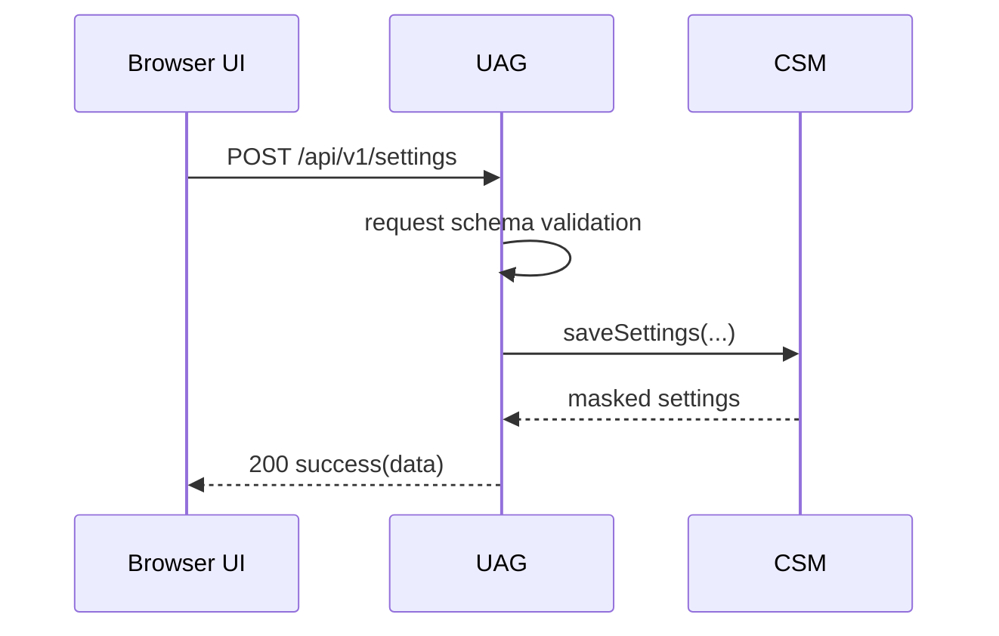
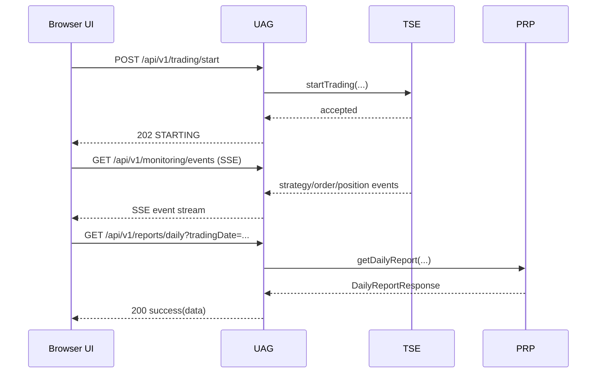

# LLD-UAG v0.1.0

- 문서명: UAG 모듈 저수준 설계서 (LLD)
- 버전: v0.1.0
- 작성일: 2026-02-17
- 기반 문서:
  - `docs/hld/HLD-v0.1.0.md` (특히 4.1, 5)
  - `docs/srs/SRS-v0.1.0.md`
  - `docs/lld/LLD-CSM-v0.1.0.md`
  - `docs/lld/LLD-TSE-v0.1.0.md`
  - `docs/lld/LLD-PRP-v0.1.0.md`
- 모듈: `UAG` (UI/API Gateway)

## 1. 모듈 범위와 책임

`UAG`는 브라우저 UI 요청을 수신하는 API 경계 모듈로서, 입력 검증·응답 표준화·민감정보 마스킹·실행 제어·모니터링/리포트 조회를 담당한다.

- 설정 입력/수정/조회 API 제공 (SRS FR-001, FR-012, FR-014)
- 투자 시작/중지 제어 API 제공 (SRS FR-015)
- 감시/주문/포지션 상태 조회 API 및 실시간 스트림 제공 (SRS FR-015)
- 일자 요약/상세 리포트 조회 API 제공 (SRS FR-016, FR-017)
- 공통 오류 응답 모델 강제 및 민감정보 비노출 (HLD 5.1, SRS NFR-002)

비범위(Out of Scope):
- 전략 판정 알고리즘(TSE)
- 주문 실행 및 체결 동기화(OPM/KIA)
- 리포트 계산(PRP)

## 2. API 설계 원칙

### 2.1 공통 규약

- Base Path: `/api/v1`
- Content-Type: `application/json; charset=utf-8`
- 시간 표기: ISO-8601 (`+09:00` 포함)
- 수치 정밀도: 금액/가격은 Decimal 문자열 허용, 내부 Decimal 변환
- 식별자: `requestId`를 모든 응답에 포함

### 2.2 성공 응답 포맷

```json
{
  "success": true,
  "requestId": "req-20260217-0001",
  "data": {},
  "meta": {
    "timestamp": "2026-02-17T09:10:00+09:00"
  }
}
```

### 2.3 오류 응답 포맷(표준화)

```json
{
  "success": false,
  "requestId": "req-20260217-0002",
  "error": {
    "code": "UAG_VALIDATION_ERROR",
    "message": "입력값 검증에 실패했습니다.",
    "retryable": false,
    "source": "UAG",
    "details": [
      {
        "field": "watchSymbols[0]",
        "reason": "6자리 숫자 형식이 아닙니다."
      }
    ]
  },
  "meta": {
    "timestamp": "2026-02-17T09:10:01+09:00"
  }
}
```

표준 매핑 규칙:
- UAG 입력 오류: `4xx` + `source=UAG`
- 하위 모듈 비즈니스 오류(CSM/TSE/PRP): 모듈 오류코드 유지 + `4xx`
- 하위 모듈 일시 오류(KIA 타임아웃/DB 일시 장애): `503` + `retryable=true`
- 미처리 예외: `500` + `UAG_INTERNAL_ERROR`

## 3. 인증/세션 가정 (로컬 사용)

v0.1.0 로컬 운영 가정:
- 서버는 개인 PC에서만 실행되며 기본 바인딩은 `127.0.0.1`이다.
- 외부 인증 서버/OAuth는 사용하지 않는다.
- 브라우저 세션은 UAG가 발급하는 로컬 세션 쿠키 1종(`uag.sid`)으로 유지한다.
- 세션 TTL은 12시간, 비활성 30분 시 갱신 필요.
- 상태 변경 API(`POST /settings`, `/mode/switch`, `/trading/start`, `/trading/stop`)는 CSRF 토큰 필요.
- 조회 API는 동일 세션에서만 허용하며 CORS 허용 Origin은 `http://localhost:*`로 제한.

세션 실패 처리:
- 세션 없음/만료: `401 UAG_SESSION_REQUIRED`
- CSRF 불일치: `403 UAG_CSRF_INVALID`

## 4. 엔드포인트 상세 (UI 요구 기준)

## 4.1 설정 조회/저장

### GET `/api/v1/settings`

목적: 현재 감시 종목/모드/마스킹된 자격정보 조회

응답(`200`):
```json
{
  "success": true,
  "requestId": "req-1",
  "data": {
    "watchSymbols": ["005930", "000660"],
    "mode": "mock",
    "liveModeConfirmed": false,
    "credentialMasked": {
      "appKey": "***masked***",
      "appSecret": "***masked***",
      "accountNo": "******7890",
      "userId": "de***"
    }
  }
}
```

### POST `/api/v1/settings`

요청:
```json
{
  "watchSymbols": ["005930", "000660"],
  "mode": "mock",
  "liveModeConfirmed": false,
  "credential": {
    "appKey": "<plain>",
    "appSecret": "<plain>",
    "accountNo": "1234-56-7890",
    "userId": "demoUser"
  }
}
```

응답(`200`):
```json
{
  "success": true,
  "requestId": "req-2",
  "data": {
    "configVersion": "v0.1.0",
    "updatedAt": "2026-02-17T09:12:00+09:00",
    "watchSymbols": ["005930", "000660"],
    "mode": "mock",
    "liveModeConfirmed": false,
    "credentialMasked": {
      "appKey": "***masked***",
      "appSecret": "***masked***",
      "accountNo": "******7890",
      "userId": "de***"
    }
  }
}
```

검증 규칙:
1) `watchSymbols` 1~20개, 6자리 숫자, 중복 불가 (FR-001)
2) `mode`는 `mock|live`만 허용 (FR-014)
3) `mode=live`면 `liveModeConfirmed=true` 필수
4) 자격정보 필수 필드 누락/공백 불가 (FR-012)
5) `accountNo`는 하이픈 제거 후 숫자만 허용

## 4.2 모드 전환

### POST `/api/v1/mode/switch`

요청:
```json
{
  "targetMode": "live",
  "liveModeConfirmed": true
}
```

응답(`200`):
```json
{
  "success": true,
  "requestId": "req-3",
  "data": {
    "mode": "live",
    "updatedAt": "2026-02-17T09:13:10+09:00"
  }
}
```

검증/선행조건:
- `targetMode` 필수, `mock|live`만 허용
- `live` 전환 시 확인 플래그 필수
- CSM/OPM 가드 조건 충족 필요(미체결 0, 포지션 0, 엔진 IDLE)

## 4.3 투자 시작/중지

### POST `/api/v1/trading/start`

요청:
```json
{
  "tradingDate": "2026-02-17",
  "dryRun": false
}
```

응답(`202`):
```json
{
  "success": true,
  "requestId": "req-4",
  "data": {
    "engineState": "STARTING",
    "acceptedAt": "2026-02-17T09:00:00+09:00"
  }
}
```

### POST `/api/v1/trading/stop`

요청:
```json
{
  "reason": "user_request"
}
```

응답(`202`):
```json
{
  "success": true,
  "requestId": "req-5",
  "data": {
    "engineState": "STOPPING",
    "acceptedAt": "2026-02-17T14:30:00+09:00"
  }
}
```

검증 규칙:
- 중복 시작 요청 차단: `UAG_ENGINE_ALREADY_RUNNING` (`409`)
- 중복 중지 요청 차단: `UAG_ENGINE_ALREADY_STOPPED` (`409`)
- `tradingDate` 형식 오류 시 `400`

## 4.4 모니터링 조회 (Polling)

### GET `/api/v1/monitoring/snapshot`

쿼리:
- `include=watch,orders,position,strategy` (선택)

응답(`200`):
```json
{
  "success": true,
  "requestId": "req-6",
  "data": {
    "engineState": "RUNNING",
    "asOf": "2026-02-17T10:00:05+09:00",
    "watch": [
      {
        "symbol": "005930",
        "state": "BUY_CANDIDATE",
        "basePrice": 71200.0,
        "localLow": 70480.0,
        "dropRate": 1.0112,
        "reboundRate": 0.1419
      }
    ],
    "orders": [
      {
        "orderId": "KIW-20260217-00001",
        "symbol": "005930",
        "side": "BUY",
        "status": "ACCEPTED",
        "updatedAt": "2026-02-17T09:05:12+09:00"
      }
    ],
    "position": {
      "symbol": "005930",
      "quantity": 14,
      "avgBuyPrice": 70610.0,
      "currentProfitRate": 0.8421,
      "maxProfitRate": 1.1210,
      "minProfitLocked": false
    }
  }
}
```

## 4.5 모니터링 실시간 스트림 (SSE)

### GET `/api/v1/monitoring/events`

- Content-Type: `text/event-stream`
- 이벤트 타입:
  - `heartbeat` (5초)
  - `strategy` (BUY_CANDIDATE, BUY_SIGNAL, SELL_SIGNAL 등)
  - `order`
  - `position`
  - `engine`

SSE 이벤트 예시:
```text
event: strategy
data: {"occurredAt":"2026-02-17T09:05:10+09:00","symbol":"005930","eventType":"BUY_SIGNAL","reboundRate":0.2128}

```

## 4.6 리포트 조회

### GET `/api/v1/reports/daily`

쿼리:
- `tradingDate=2026-02-17` (필수)

응답(`200`):
```json
{
  "success": true,
  "requestId": "req-7",
  "data": {
    "tradingDate": "2026-02-17",
    "totalBuyAmount": 988540.0,
    "totalSellAmount": 1002130.0,
    "totalSellTax": 2004.26,
    "totalSellFee": 110.23,
    "totalNetPnl": 11475.51,
    "totalReturnRate": 1.1608,
    "generatedAt": "2026-02-17T15:31:00+09:00"
  }
}
```

### GET `/api/v1/reports/trades`

쿼리:
- `tradingDate=2026-02-17` (필수)
- `symbol=005930` (선택)

응답(`200`):
```json
{
  "success": true,
  "requestId": "req-8",
  "data": {
    "items": [
      {
        "tradingDate": "2026-02-17",
        "symbol": "005930",
        "buyExecutedAt": "2026-02-17T09:05:13+09:00",
        "sellExecutedAt": "2026-02-17T10:22:40+09:00",
        "quantity": 14,
        "buyPrice": 70610.0,
        "sellPrice": 71580.0,
        "buyAmount": 988540.0,
        "sellAmount": 1002120.0,
        "sellTax": 2004.24,
        "sellFee": 110.23,
        "netPnl": 11465.53,
        "returnRate": 1.16
      }
    ]
  }
}
```

## 5. 입력 스키마와 검증 상세

## 5.1 스키마 요약

- `SettingsSaveRequest`
  - `watchSymbols: string[1..20]`
  - `mode: "mock"|"live"`
  - `liveModeConfirmed: boolean`
  - `credential.appKey/appSecret/accountNo/userId: string`
- `ModeSwitchRequest`
  - `targetMode: "mock"|"live"`
  - `liveModeConfirmed: boolean`
- `StartTradingRequest`
  - `tradingDate: YYYY-MM-DD`
  - `dryRun: boolean(default=false)`

## 5.2 검증 실패 코드

- `UAG_VALIDATION_ERROR` (공통)
- `UAG_SYMBOL_COUNT_OUT_OF_RANGE`
- `UAG_SYMBOL_FORMAT_INVALID`
- `UAG_SYMBOL_DUPLICATED`
- `UAG_MODE_INVALID`
- `UAG_LIVE_CONFIRM_REQUIRED`
- `UAG_CREDENTIAL_REQUIRED_FIELD_MISSING`
- `UAG_DATE_FORMAT_INVALID`

검증 처리 원칙:
- 다중 필드 오류는 `error.details[]`에 모두 포함
- 평문 자격정보는 `details`에도 포함 금지

## 6. 자격정보 마스킹 동작

UAG는 CSM 규칙을 상속하여 모든 외부 노출에 동일 마스킹을 적용한다.

- `appKey`: `***masked***`
- `appSecret`: `***masked***`
- `accountNo`: 뒤 4자리만 노출 (`******7890`)
- `userId`: 앞 2자리 노출 (`de***`)

적용 지점:
- `GET /settings`, `POST /settings` 응답
- 운영 로그
- 오류 응답(`message`, `details`)

금지 규칙:
- 요청 원문(credential 전체) 로그 출력 금지
- 예외 스택에 포함된 평문의 원문 전달 금지

## 7. 모니터링 전송 전략 (Polling + SSE)

## 7.1 선택 전략

- 기본: Polling (`GET /monitoring/snapshot`, 2초 주기)
- 선택: SSE (`GET /monitoring/events`) 연결 시 이벤트 기반 갱신
- 폴백: SSE 연결 실패/종료 시 Polling 자동 복귀

## 7.2 Polling 정책

- 권장 주기: 2초
- 서버 보호: 동일 세션 기준 최소 1초 rate-limit
- 변경 없음 최적화: `ETag`/`If-None-Match` 지원(`304` 반환)

## 7.3 SSE 정책

- heartbeat: 5초
- 재연결: 클라이언트 `retry: 3000` 권장
- 백프레셔: 세션당 버퍼 초과 시 가장 오래된 이벤트 폐기 후 `monitoring_lag=true` 플래그 전송
- 연결 종료: 엔진 `STOPPED` 상태 30초 지속 시 서버 측 정상 종료 가능

## 8. 내부 호출 계약 (UAG -> CSM/TSE/PRP)

- `UAG -> CSM`
  - `saveSettings(SaveSettingsRequest)`
  - `getSettings()`
  - `switchMode(targetMode, liveModeConfirmed)`
- `UAG -> TSE`
  - `startTrading(StartTradingCommand)`
  - `stopTrading(StopTradingCommand)`
  - `getMonitoringSnapshot()`
  - `subscribeMonitoringEvents()`
- `UAG -> PRP`
  - `getDailyReport(tradingDate)`
  - `getTradeDetails(tradingDate, symbol?)`

UAG 책임 원칙:
- 하위 모듈 오류코드 유지 전달
- HTTP 상태코드/응답 포맷 표준화만 UAG에서 수행

## 9. 시퀀스

## 9.1 설정 저장



## 9.2 투자 시작 + 모니터링



## 10. 오류 코드 표준

| 코드 | HTTP | retryable | source | 의미 |
|---|---:|---|---|---|
| UAG_VALIDATION_ERROR | 400 | false | UAG | 입력 스키마/규칙 위반 |
| UAG_SESSION_REQUIRED | 401 | false | UAG | 세션 없음/만료 |
| UAG_CSRF_INVALID | 403 | false | UAG | CSRF 토큰 불일치 |
| UAG_ENGINE_ALREADY_RUNNING | 409 | false | UAG | 이미 실행 중 |
| UAG_ENGINE_ALREADY_STOPPED | 409 | false | UAG | 이미 중지 상태 |
| CSM_MODE_SWITCH_PRECONDITION_FAILED | 409 | false | CSM | 모드 전환 선행조건 위반 |
| KIA_API_TIMEOUT | 503 | true | KIA | 외부 API 타임아웃 |
| PRP_DB_READ_FAILED | 503 | true | PRP | 리포트 조회 저장소 일시 장애 |
| UAG_INTERNAL_ERROR | 500 | false | UAG | 미처리 내부 오류 |

## 11. 추적성 매트릭스 (FR/NFR)

| 요구사항 | 요구 요약 | UAG 설계 반영 |
|---|---|---|
| FR-001 | 감시 종목 1~20 등록/검증 | 4.1, 5장 검증 규칙 |
| FR-012 | 자격정보 웹 입력/검증/저장 | 4.1 설정 API, 5장 스키마 |
| FR-014 | 모의/실전 모드 전환 | 4.2 모드 전환 API |
| FR-015 | 투자 시작/모니터링 | 4.3, 4.4, 4.5 |
| FR-016 | 결과 리포트 생성 데이터 제공 | 4.6 `GET /reports/daily` |
| FR-017 | 일자/상세 리포트 조회 | 4.6 `GET /reports/trades` |
| NFR-001 | 검증 가능 요구 명세 | 5장 입력 스키마/오류 코드 |
| NFR-002 | 민감정보 마스킹/로그 보호 | 6장 마스킹 규칙, 2.3 오류 표준 |
| NFR-003 | 재시작 후 설정/상태 복원 지원 | 4.1 조회 API, 8장 CSM/TSE/PRP 연계 |
| NFR-004 | 계산 일관성 | 4.6 PRP 계산 결과 원형 전달 |
| NFR-005 | 감사 가능 이벤트 추적 | 4.5 SSE 이벤트, 8장 PRP/TSE 연계 |

## 12. 결론

본 LLD-UAG v0.1.0은 HLD 4.1/5 계약을 기반으로 브라우저 UI 연계에 필요한 API 표준, 검증, 마스킹, 모니터링 전송 전략(Polling/SSE), 로컬 인증/세션 가정, 오류 표준화, FR/NFR 추적성을 구현 가능한 수준으로 구체화한다.
